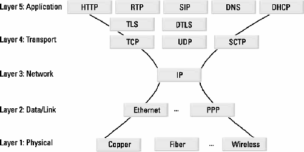
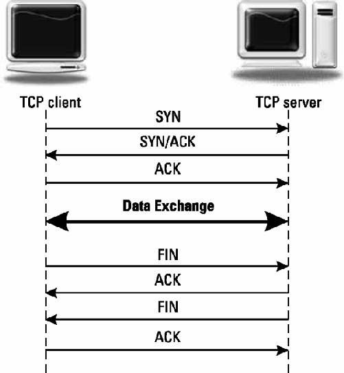
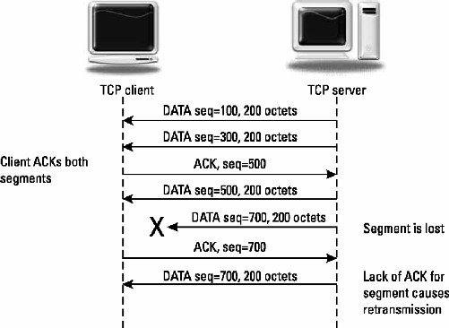
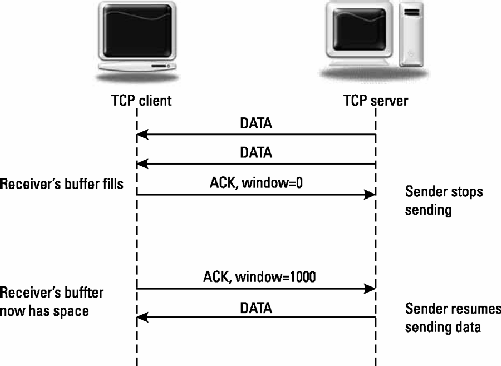

# 1	SIP and the Internet

The Session Initiation Protocol (SIP) is a signaling, presence, and instant messaging protocol developed to set up, modify, and tear down multimedia sessions; request and deliver presence; and send and receive instant messages [^1]. When teaching or lecturing about SIP, I begin by explaining that SIP is an Internet protocol. This actually means much more than just that SIP runs over the Internet. This means that SIP uses and takes advantage of the Internet architecture and protocol suite. This chapter will introduce the Transmission Control Protocol/Internet Protocol (TCP/IP) suite that is the foundation for the Internet and SIP. First, some of the basic concepts of Internet protocols such as TCP, IP, User Datagram Protocol (UDP), and the Domain Name System (DNS) will be covered. SIP, along with many other Internet protocols, has been developed by the Internet Engineering Task Force (IETF). The processes, steps, and life cycle involved in the development of Internet standards will also be covered. This chapter ends with a brief history of SIP.

## 1.1	Signaling Protocols
This book is about the session initiation protocol (SIP). As the name implies, the protocol allows two end points to establish media sessions with each other. The main signaling functions of the protocol are as follows:

- Location of an end point;
- Contacting an end point to determine willingness to establish a session;
- Exchange of media information to allow a session to be established;
- Modification of existing media sessions;
- Teardown of existing media sessions.

SIP has also been extended to request and deliver presence information (online/off-line status and location information such as that contained in a buddy list) as well as instant message sessions. These functions include:

- Publishing and uploading of presence information;
- Requesting delivery of presence information;
- Presence and other event notification;
- Transporting of instant messages.

While some of the examples discuss SIP from a telephony perspective, there will be many non-telephony uses for SIP. SIP will likely be used to establish a set of session types that bear almost no resemblance to a telephone call.

The following section will introduce the Internet multimedia protocol stack and discuss these protocols at a high level.

## 1.2	Internet Multimedia Protocol Stack

Figure 1.1 shows the five layer Internet multimedia protocol stack. The layers shown and protocols identified will be discussed.



### 1.2.1	Physical Layer

The physical layer is the lowest layer of the protocol stack. It shows how devices are physically connected with each other. Common physical layer methods include copper (coax, twisted pair, or other wired connections), photons (fiber optics, laser light, or other photonic sources), or phonons (radio waves, microwaves, or other electromagnetic transmissions).

### 1.2.2	Data/Link Layer

The next layer is the data/link layer, which could be an Ethernet local area network (LAN), Point-to-Point Protocol (PPP), a digital subscriber line (DSL), or even a wireless 802.11 network. This layer performs such functions as symbol exchange, frame synchronization, and physical interface specification. Ethernet typically adds a 13-octet header and a 3-octet footer to every packet sent. Note that an octet is 8 bits of data, sometimes called a byte.

### 1.2.3	Network Layer

The next layer in Figure 1.1 is the network or Internet layer. IP [^2] is used at this layer to route a packet across the network using the destination IP address. IP is a connectionless, best-effort packet delivery protocol. IP packets can be lost, delayed, or received out of sequence. Each packet is routed on its own using the IP header appended to the physical packet. Most IP address examples in this book use the older version of IP, version 4 (IPv4). IPv4 addresses are 4 octets long, usually written in “dotted decimal” notation (for example, `207.134.3.5`). At the IP layer, packets are not acknowledged. A checksum is calculated to detect corruption in the IP header, which could cause a packet to become misrouted. However, corruption or errors in the IP payload are not detected; a higher layer must perform this function if necessary, and it is usually done at the transport layer. IP uses a single-octet protocol number in the packet header to identify the transport layer protocol that should receive the packet.

IP version 6 (IPv6) [^3] was developed by the IETF as a replacement for IPv4. IPv6 traffic is ramping up, and most Internet sites and services support IPv6 today. The biggest initial networks of IPv6 are wireless telephony carriers who need the most important advantage of IPv6 over IPv4—a much enlarged addressing space. IPv6 increases the addressing space from 32 bits in IPv4 to 128 bits, providing for over approximately 3.4 × 1038 IPv6 addresses. An IPv6 address is typically written as a sequence of eight hexadecimal numbers separated by colons. For example, `0:0:0:0:aaaa:bbbb:cccc:dddd `is an IPv6 address written in this format. It is also common to drop sequences of zeros with a single double colon. This same address can then be written as `::aaaa:bbbb:cccc:dddd`. SIP can use either IPv4 or IPv6.

IP addresses used over the public Internet are assigned in blocks by regional Internet registries (RIR). For example, the American Registry for Internet Numbers (ARIN) allocates addresses in North America while Réseaux IP Européens Network Coordination Centre (RIP ENCC) allocates addresses in Europe. The Internet Assigned Number Association (IANA) manages the overall IP address pool, delegating blocks to the RIRs. Individual end users and enterprises use IP addresses allocated to them by their Internet Service Provider (ISP) from a regional registry.

As a result of this centralized assignment, IP addresses are globally unique. This enables a packet to be routed across the public Internet using only the destination IP address. Various protocols are used to route packets over an IP network, but they are outside of the scope of this book. Subnetting and other aspects of the structure of IP addresses are also not covered here. There are other excellent sources [^4] that cover the entire suite of TCP/IP in more detail.

Private IP addresses are addresses that are not routable on the public Internet but can be routable on a stub network LAN. A router performing network address translation (NAT) is used when a host with a private IP address needs to access resources on the public Internet. NAT temporarily binds or maps a host’s private IP address, which is only routable within the LAN with a public IP address that has been allocated to the NAT. The NAT rewrites IP packets as they pass through in both directions, allowing connections. A detailed description of NAT and how it affects SIP and Internet communications can be found in Chapter 10. There are three IPv4 address blocks that have been allocated for private addresses in [^5]:

```ini
10.0.0.0 - 10.255.255.255 or 10/8
172.16.0.0 - 172.31.255.255 or 172.16/12
192.168.0.0 - 192.168.255.255 or 192.168/16
```

Configuration information for IP can be manually configured in a host or it can be learned automatically. Typically, a host needs to know its own IP address, default gateway, subnet mask, and DNS server addresses. One common protocol for this is Dynamic Host Configuration Protocol (DHCP), which is defined by [^6]. DHCP allows a host to autodiscover all these parameters upon initialization of the IP stack. There are various DHCP extensions that have been defined to autoconfigure other protocols, including SIP.

### 1.2.4	Transport Layer

The next layer shown in Figure 1.1 is the transport layer. It uses a 2-octet port number from the application layer to deliver the datagram or segment to the correct application layer protocol at the destination IP address. There are two commonly used transport layer protocols: TCP and UDP. In addition, there are two uncommon transport protocols: Stream Control Transmission Protocol (SCTP) and Datagram Congestion Control Protocol (DCCP), which are beginning to be used on the Internet. There is also the Transport Layer Security (TLS) protocol, which provides security on top of TCP. These protocols are introduced in the following sections.

####	1.2.4.1	TCP

TCP [^7] provides reliable, connection-oriented transport over IP. A TCP connection between two hosts over an IP network is sometimes known as a socket. TCP is a client/server protocol. Servers “listen” on a specific port number for an incoming request to open a socket. A client sends a request to open a new socket to the server on the well-known port. The combination of the source IP address, source port, destination IP address, and destination port identifies the socket connection. As such, it is possible for two hosts to have multiple TCP connections open between them.

TCP uses sequence numbers and positive acknowledgments to ensure that each block of data, called a segment, has been received. Lost segments are retransmitted until they are successfully received. Figure 1.2 shows the message exchange to establish and tear down a TCP connection. A TCP server listens on a well-known port for a TCP SYN (synchronization) message to open the connection. The SYN message contains the initial sequence number the client will use during the connection. The server responds with an ACK message to acknowledge the SYN with an acknowledgment number and then follows up with its own SYN message containing its own initial sequence number. Often, these two messages are combined into one SYN-ACK message that does both functions. The client completes the three-way handshake with an ACK or a DATA packet with the ACK flag set to the server acknowledging the server’s sequence number. Now that the connection is open, either client or server can send data in DATA packets (segments). The connection is closed when either side sends a FIN packet that receives an ACK. This exchange is shown in Figure 1.2.



TCP sends data in units called segments. The maximum segment size (MSS) is negotiated between the hosts during the handshake and is usually based on the maximum transmission unit (MTU) of the local network. In general, the larger the segment size, the more efficient the transport, except when packet loss is present when smaller segments can result in fewer retransmissions. A typical MTU value for the Internet is 1,500 octets.

TCP uses cumulative acknowledgements for reliability. The recipient sends ACK packets including the next sequence number it expects to receive. If a sender does not receive an ACK within a certain time period, the segment is resent. An example is shown in Figure 1.3.



TCP also has built-in flow control. Flow control is used by a receiver to slow down the rate of transmission to allow the receiver to properly process or buffer incoming segments. TCP uses a sliding window for end-to-end control.

Senders can only send the number of octets in the window before waiting for an ACK. A receiver can reduce the size of the window in ACK messages, even setting it to 0 to cause the sender to stop sending. Once the receiver has caught up, another ACK can be sent to increase the window size and resume the flow of segments. This is shown in Figure 1.4.



TCP also has built in congestion control. TCP uses a slow-start algorithm to attempt to avoid congestion. When congestion occurs, TCP uses a fast retransmit and a fast recovery. The details of how these algorithms work can be found in any good TCP/IP reference such as [^4].

TCP adds a 20-octet header field to each packet and is a stream-oriented transport. An application using TCP to send messages must provide its own framing or separation between messages. Error segments are detected by a checksum covering both the TCP header and payload.

#### 1.2.4.2	Transport Port Numbers

Ports numbers are used by the transport layer to multiplex and demultiplex multiple connections on a single host. Otherwise, a pair of hosts could only have a single connection between them. Also, messages for different protocols can be separated by using different port numbers. Often these port numbers are associated with a specific protocol. Others are registered to a particular protocol. Ports are a 16-bit integer. Ports in the range 0 to 1023 are called well-known ports. Ports in the range of 1024 through 49151 are known as registered ports. Ports in the range of 49152 through 65535 are known as dynamic, private, or ephemeral ports. For example, Web servers use the well-known port of 80, SIP uses the registered ports of 5060 and 5061, and RTP usually uses a dynamic port.

#### 1.2.4.3	UDP

UDP [^8] provides unreliable transport across the Internet. It is a best-effort delivery service, since there is no acknowledgment of sent datagrams. Most of the complexity of TCP is not present, including sequence numbers, acknowledgments, and window sizes. UDP does detect datagrams with errors with a checksum. It is up to higher-layer protocols to detect this datagram loss and initiate a retransmission if desired.

UDP does not provide congestion control or flow control—if any of these functions are needed, they must be built into the application layer protocol. UDP is best suited for short, single packet exchanges such as DNS or routing queries. It is also good for real-time, low-latency transports protocols such as SIP and RTP.

UDP adds an 8-octet header field to datagrams. Applications and protocols that use UDP must do their own framing—they must break up information into individual UDP packets. For a message-oriented protocol, this typically means one message or request per UDP datagram.

#### 1.2.4.4	TLS

TLS [^9] is based on the Secure Sockets Layer (SSL) protocol first used in Web browsers. TLS uses TCP for transport, although it has been extended to also run over UDP. TLS is commonly used today on the Internet for secure Web sites using the secure HTTP (https) URI scheme.

The TLS protocol has two layers: the TLS Transport Protocol and the TLS Handshake Protocol. The TLS Transport Protocol is used to provide a reliable and private transport mechanism. Data sent using the TLS Transport Protocol is encrypted so that a third party cannot intercept the data. A third party also cannot modify the transported data without one of the parties discovering this. The TLS Handshake Protocol is used to establish the connection, negotiate the encryption keys used by the TLS Transport Protocol, and provide authentication.

The key agreement scheme selects an encryption algorithm and generates a one-time key based on a secret passed between the two sides. During the handshake, the parties exchange certificates, which can be used for authentication. The cryptographic computations for a TLS connection are not trivial, and the multiple round trips needed to open a connection can add to message latency. Also, certificate verification can introduce processing delays. However, TLS transport has clear security advantages over UDP or TCP. TLS is widely supported due to its use in secure Web browsers and servers. TLS will be discussed more in Chapter 15.

#### 1.2.4.5	SCTP

SCTP [^10] is similar to TCP in that it provides reliable stream-based transport. However, it has some advantages over TCP transport for a message-based protocol. First, it has built-in message segmentation, so that individual messages are separated at the transport layer. Another advantage is that SCTP avoids the head-of-line blocking problem of TCP. This is a TCP problem in which a dropped segment with a large window causes the entire window’s worth of messages to wait in a buffer (that is, be blocked) until the dropped segment is retransmitted.

SCTP also supports multihoming, so if one of a pair of load balancing servers fails, the other can immediately begin receiving the messages without even requiring a DNS or other database lookup.

As a transport protocol, SCTP requires operating system level support to be used, which will initially delay its use in the Internet. Also, as we shall see in Chapter 10 on NAT traversal, the use of new transports on the Internet is severely limited by their support in middle boxes such as NAT. Also, note that the advantages of SCTP over TCP only occur during packet loss. In a zero-loss network, the performance of the two is identical. SCTP is not commonly supported in Internet hosts today, but it is being used in WebRTC, as discussed in Chapter 19.

#### 1.2.4.6	DCCP

DCCP [^11] is another new transport protocol that tries to provide congestion and flow control similar to TCP but without the reliability or in-order delivery of TCP. It shows some promise for use as a real-time transport. However, its support is very limited today, and limited NAT support will delay its adoption.

### 1.2.5	Application Layer

The top layer shown in Figure 1.1 is the application layer. This includes signaling protocols such as SIP and media transport protocols such as Real-Time Transport Protocol (RTP), which is introduced in Chapter 12. HTTP, SMTP, File Transfer Protocol (FTP), and Telnet are all examples of application layer protocols. SIP can theoretically use any transport protocol, although it is currently standardized to run over TCP, UDP, and SCTP. The use of TCP, TLS, SCTP, and UDP transport for SIP will be discussed in the next chapter.

### 1.2.6	Utility Applications

Two Internet utility applications are also shown in Figure 1.1. The most common use of the DNS (well-known port number 53) is to resolve a symbolic name (such as example.org, which is easy to remember) into an IP address (which is required by IP to route the packet). Also shown is DHCP. DHCP allows an IP device to download configuration information upon initialization. Common fields include a dynamically assigned IP address, DNS addresses, subnet masks, maximum transmission unit (MTU), or maximum packet size, and server addresses for e-mail and Web browsing. SIP has a DHCP extension for configuration [^12].

Another utility is Internet Control Message Protocol (ICMP), a control and diagnostic protocol that runs between single IP routing hops—between routers and between routers and hosts. It runs directly on top of the IP layer without a transport protocol, using protocol 1. The most common ICMP message is a Type 8 Echo Request or ping. Ping tests can be used to verify connectivity. A Type 0 Echo Reply is a ping response whose latency is often measured and displayed. Other ICMP error messages include a Type 3 Destination Unreachable message or a Type 11 TTL Exceeded for Datagram where TTL stands for Time to Live. ICMP is also used to provide the traceroute (tracert on Windows) Internet utility used to discover IP hops between hosts.

### 1.2.7	Multicast

In normal Internet packet routing, or unicast routing, a packet is routed to a single destination. In multicast routing, a single packet is routed to a set of destinations. Single LAN segments running a protocol such as Ethernet offer the capability for packet broadcast, where a packet is sent to every node on the network. Scaling this to a larger network with routers is a recipe for disaster, as broadcast traffic can quickly cause congestion. An alternative approach for this type of packet distribution is to use a packet reflector that receives packets and forwards copies to all destinations that are members of a broadcast group. For a number of years, the Internet Multicast Backbone Network (MBONE), an overlay of the public Internet, has used multicast routing for high-bandwidth broadcast sessions. Participants who wish to join a multicast session send a request to join the session to their local MBONE router using a protocol known as Internet Group Management Protocol (IGMP). That router will then begin to broadcast the multicast session on that LAN segment.

Additional requests to join the session from others in the same LAN segment will result in no additional multicast packets being sent, since the packets are already being broadcast. If the router is not aware of any multicast participants on its segment, it will not forward any of the packets. Routing of multicast packets between routers uses special multicast routing protocols to ensure that packet traffic on the backbone is kept to a minimum. Multicast IPv4 Internet addresses are reserved in the range of 224.0.0.0 to 239.255.255.255.

Multicast transport is always UDP, since the handshake and acknowledgments of TCP are not possible. Certain addresses have been defined for certain protocols and applications. The scope or extent of a multicast session can be limited using the TTL field in the IP header. This field is decremented by each router that forwards the packet, which limits the number of hops the packet takes. SIP support for multicast will be discussed in Section 3.9. Multicast is slowly becoming a part of the public Internet as service providers begin supporting it, and it is finding an important application today in the streaming of real-time video to set-top boxes sometimes known as IPTV. There is another approach known as application layer multicast, which uses peer-to-peer technology, which does not require any changes at the IP layer. This will be discussed in Chapter 18.

## 1.3	Internet Names

Internet addresses, covered in Chapter 2, are used to route individual datagrams over the Internet. However, they are not very friendly for humans to use. IPv4 addresses can be as long as 12 digits, while IPv6 addresses can be as long as 32 hexadecimal digits. A given Internet host with only one IP address may have many identities. Also, some Internet identities are that of the human user, not the actual host. For example, an e-mail address identifies a user, not a particular host on the Internet. The user may utilize multiple Internet hosts to access e-mail.

Internet names began with RFC 822 [^13], which defined the user@host format that is so familiar today with e-mail addresses. These text-based names were defined to enable a piece of software known as a parser to be able to extract the various parts of the address and any parameters. In addition, some of the first Internet applications such as e-mail used a text-based way of encoding protocol messages. The method of encoding both Internet names and messages was defined in RFC 822 as Backus Naur Format (BNF). BNF was developed by John Backus to define the early programming language ALGOL. Today, many Internet protocols, including SIP, are defined using Augmented Backus Naur Form (ABNF) [^14], which is based on BNF. The Appendix has an introduction to ABNF.

## 1.4	URLs, URIs, and URNs

Uniform Resource Locators (URLs) are an addressing scheme developed for the World Wide Web (WWW). It is defined in RFC 1738 [^15] and is a syntax for representing a resource available on the Internet. The general form is:

```ini
scheme:scheme-specific-part
```

for example, consider:

```ini
http://www.artechhouse.com/Default.aspx
```

The token http identifies the scheme or protocol to be used, in this case HTTP. The specifier follows the “:” and contains a domain name (www.artechhouse.com), which can be resolved into an IP address, and a file name (/Default.aspx). URLs can also contain additional parameters or qualifiers relating to transport, but they can never contain spaces. For example, telnet://host.company.com:24 indicates that the Telnet Protocol should be used to access host.company.com using port 24. New schemes for URLs for new protocols are easily constructed, and dozens have been defined, such as mailto, tel, and https. The sip and sips schemes will be introduced in Section 4.2.

Most protocols reference URLs, but with SIP we mainly reference Uniform Resource Indicators (URIs). This is due to the mobility aspects of SIP, which means that a particular address (URI) is not tied to a single physical device but instead is a logical entity that may move around and change its location in the Internet. However, the terms URL and URI are often used almost interchangeably in other contexts.

Some other examples include:

```ini
http://www.ese.wustl.edu
sip:barney@fwd.rubble.example.com
mailto:help@example.org?Subject=Help!
```

Common SIP and Internet Communications URL and URI schemes are listed in Table 1.1. The details of SIP and SIPs URIs are covered in Section 4.2.

Uniform Resource Names (URNs) are defined by [^16]. A URN provides a standard name for a resource but does not provide any information for how to access the resource. An example URN namespace is International Standard Book Numbers (ISBNs):

```ini
URN:ISBN:1-60783-995-4
URN namespaces are often used to identify XML extensions.
```

## 1.5	Domain Name Service

The Domain Name Service [17] is used on the Internet to map a symbolic name (such as www.example.com) to an IP address (such as 100.101.102.103, which is an example IPv4 address). DNS is also used to obtain information needed to route various protocol messages, including SIP messages. The use of names instead of numerical addresses is one of the Internet’s greatest strengths because it gives the Internet a human, friendly feel. Domain names are organized in a hierarchy. Each level of the name is separated by a dot, with the highest-level domain on the right side. (Note that the dots in a domain name have no correspondence to the dots in an IP address written in dotted decimal notation.) General top-level domains are shown in Table 1.2 (see http://www.icann.org/tlds for the latest list). Some such as com, net, and edu are commonly encountered, while others such as aero and coop are rare. There is also a set of country domains such as: us (United States), uk (United Kingdom), ca (Canada), and au (Australia). Each of these top-level domains has just one authority that assigns that domain to a user or group. Many new top-level domains are coming.

Table 1.1

URL and URI Schemes Used in Internet Communications

Scheme	Protocol
sip	SIP
sips	Secure SIP (TLS)
tel	Telephone number and dial string
im	Instant messaging inbox
pres	Presence
xmpp	Jabber IM and presence
h323	H.323
http	Hypertext Tranfer Protocol
mailto	Electronic mail address
Once a domain name has been assigned, the authority places a link in their DNS server to the DNS server of the user or group who has been assigned the domain. For example, when example.org is allocated to a company, the authoritative DNS server for the top-level com domain entry for example contains the IP address of the company’s DNS server(s). A name can then be further qualified by entries in the company’s DNS server to point to individual servers in their network. For example, the company’s DNS server may contain entries for www.example.com, ftp.example.com, and smtp.example.com. A number of types of DNS record types are defined. The DNS records used to resolve a host name into an IP address are called address records, or A records. Other types of records include CNAME (canonical name or alias records), MX (mail exchange records), SRV (service records, used by SIP and other protocols), and TXT (free-form text records). Another type of DNS record is a PTR, or pointer record, used for reverse lookups. Reverse lookups are used to map an IP address back to a domain name. These records can be used to generate server logs that show not only the IP addresses of clients served, but also their domain name. Web browsing provides an example of the use of the DNS system. Another type of DNS record is known as a Naming Authority Pointer (NAPTR) record that can be used by a protocol known as ENUM [18] to map global telephone numbers into Internet URLs.

Table 1.2

Generic Top-Level Domains (gTLDs)

Domain	Description
com	Company

net	Network
int	Internet
org	Not-for-profit organization
edu	University or college
gov	U.S. government
mil	U.S. military
arpa	ARPAnet
info	Information
biz	Business
museum	Museum
name	Name
pro	Professional
aero	Air transport industry
coop	Cooperatives

### 1.5.1	DNS Resource Records

DNS resource records are text records that are stored in DNS servers and retrieved by DNS resolvers. Each record has a minimum of four fields: name, type, class, and time to live (TTL). The name is the owner of the record and the resource being identified. The type is the type of resource records such as A, AAAA, MX, SRV, NAPTR, PTR, or TXT. Class is the class of address, which is IN for Internet addresses (all other network addresses are CH for Chaos). The TTL field is a 32-bit integer count of the number of seconds the record should be cached before being discarded.

Common DNS resource record types are listed in Table 1.3. The resource records used by SIP are discussed in detail in the following sections.

### 1.5.2	Address Resource Records (A or AAAA)

The most common type of resource record is an address record. As the name suggests, it provides an address for a resource or a host name. Besides the name, TTL, class, and type fields it includes a target field, which is an IP address. An A record provides [17] an IPv4 address, while an AAAA record [19] provides an IPv6 address. An AAAA record is usually called a “quad A” record.

Structure:

Name TTL Class A Target

For example,

Table 1.3

Common DNS Resource Record Types

RR Type	Reference	Description
A	RFC 1035	Address IPv4 (see Section 1.5.2)
AAAA	RFC 3596	Address IPv6 (see Section 1.5.2)
CNAME	RFC 1035	Canonical name, used for aliases
MX	RFC 1035	Mail Exchange
NAPTR	RFC 2915	Naming Authority Pointer Record, See Section 1.5.4
NS	RFC 1035	Name Server records
PTR	RFC 1035	Reverse domain name lookup
SOA	RFC 1035	Start of Authority
SPF	RFC 4408	Sender Policy Framework for Authorizing E-mail
SRV	RFC 2782	Services (see Section 1.5.3)
TXT	RFC 1035	Text records
ese.wustl.edu.

```ini
3600 IN A 128.252.168.2 ietf.org.
300 IN AAAA 2610:a0:c779:b::d1ad:35b4
```

are examples of an A record and an AAAA record. Notice the “.” used after the host name—this is to indicate that the address is absolute.

### 1.5.3	Service Resource Records (SRV)

Service resource records or SRV records [20] are used to lookup a host that provides a particular service. A number of services have been defined for SRV records including SIP service. SRV records use an underscore ( _ ) in the service name to distinguish it from normal host names, which may not include an underscore.

Structure:

Service.Proto.Name TTL Class SRV Priority Weight Port Target

The priority field is used to set the relative priority of this record, as an SRV query might return several SRV resource records. The priority is a 16-bit unsigned integer. Resolvers should use the lowest value record (highest priority). The weight is a relative weight used to select between records with the same priority. It is also a 16-bit unsigned integer. The port is the transport port number that should be used for this service. This allows multiple instances of the same service to be run on the same host—each can utilize a different port number. The target is the domain name of the host. To reach the desired service, the target address and port number should be used.

For example,

_sip._udp.example.com. 300 IN SRV 0 100 5060 sip.example.com.

This example resource record is for SIP service using UDP as the transport protocol. The priority of this record is 0, indicating that it is the highest priority. The port number is 5060, the registered port for SIP. The target is sip. example.org, which will require an address (A or AAAA) lookup to resolve to an IP address. The use of SRV records in SIP will be discussed in Section 2.6.

### 1.5.4	Naming Authority Pointer Resource Records (NAPTR)

Naming authority pointer resource records or NAPTR records [21] are used to point to another record or URI. They are used by SIP to discover which transport protocols a given domain or server supports. In a protocol known as ENUM, they are used to resolve a telephone number into a URI. The usage of NAPTR records in SIP are discussed in Section 2.6.

```ini
#Structure:
Domain TTL Class Type Order Preference Flags Service Regexp Replacement
#Example:
example.org 3600 IN NAPTR 1 0 “s” “SIP+D2U” “” _sip._udp.example.org
```


### 1.5.5	DNS Resolvers

DNS resolvers are the software in an Internet host that looks up DNS records and sends DNS requests. When a user types in a Web address, such as www. artechhouse.com, the name must be resolved to an IP address before the browser can send the request for the index Web page from the Artech House Web server. The Web browser first launches a DNS query to the IP address for its DNS server, which has been manually configured or set up using DHCP.

The first step of the DNS resolver is to check the local DNS cache to see if the desired host name is already cached. If so, it returns that value without performing a lookup. If the value is not cached, then a query will be launched. If the DNS resolver is configured with the IP address of one or more DNS servers, it may simply forward the request to that DNS server and let that server take care of the request. Alternatively, it could resolve the address on its own using the following steps. The DNS resolver would check to see if the authoritative DNS server for the top-level domain (e.g., com) is stored in its cache. If not, it will have to query a DNS root server (e.g., “.”) for this information. DNS resolvers are configured with the IP addresses of the 16 DNS root servers. One of these will be selected and the query sent. With the authoritative DNS server name for the top-level domain, the resolver will then query that DNS server for the next-level domain name (e.g., “example.org”). Once it has the authoritative DNS server for that domain, another query will be launched for the next-level domain name (e.g., “www.example.com”). This continues until the actual host name records are retrieved. At every stage, DNS servers can return cached values instead of launching a new query.

If the DNS server happens to have the name’s A record stored locally (cached) from a recent query, it will return the IP address. If not, the DNS root server will then be queried to locate the authoritative DNS server for Artech House, which must contain the A records for the artechhouse.com domain. The HTTP GET request is then sent to that IP address, and the Web browsing session begins. There is only one authoritative DNS server for a domain, and it is operated by the owner of the domain name. Due to a very efficient caching scheme built into DNS, a DNS request often does not have to route all the way to this server. DNS is also used by an SMTP server to deliver an e-mail message. An SMTP server with an e-mail message to deliver initiates a DNS request for the MX record of the domain name in the destination e-mail address. The response to the request allows the SMTP server to contact the destination SMTP server and transfer the message. A similar process is defined for locating a SIP server using SRV, or service, DNS records.

## 1.6	Global Open Standards

SIP is an example of a global, open, Internet standard. Global means that the same protocol is used regardless of the country. A Web browser or Web server works the same if it is located in the United States, Europe, or Asia. This contrasts with telephony protocols, which have historically been highly regionalized. For example, ISDN User Part (ISUP), which forms the basis for today’s telephone network, has numerous national and regional varieties. Telephone equipment can only be used in the country for which it was manufactured. Switching gear used to handle international traffic to many different countries is some of the most complicated and expensive telephone equipment. As a result, features, services, and innovation have spread very slowly over the PSTN. Contrast this to the Internet where new applications and services are immediately available worldwide to anyone with Internet connectivity.

SIP is an example of an open standard. This means that any individual or company can access the standard, participate in the standards process, and have their voices heard and their issues discussed. Again, this contrasts with other standards bodies, which have closed membership, expensive fees, or geographical restrictions. Internet standards have always been freely available to download over the Internet.

SIP is a standard because it provides a definition for how different vendors, providers, and users can interconnect and interoperate their communication equipment. As such, SIP defines message formats and state machines (i.e., “bits on the wire”). SIP does not specify architectures, business models, exact service definitions, or user interfaces.

## 1.7	Internet Standards Process

The Internet Engineering Task Force (IETF) [22] is the body that develops standards for the Internet. It is a loosely organized group of implementers, vendors, service providers, and academics who work together to solve Internet problems and develop new protocols. Anyone can participate in the IETF standards process. The first step is to find the working group in the area of interest and join their e-mail mailing list. Most of the IETF work is done over e-mail with exchanges of ideas and discussions about the standards. The basic operation and principles of the IETF are described in the well-written “Tao of the IETF” [23].

Standards begin life as a working document known as an Internet Draft. These documents are only valid for 6 months. After this time, they are either updated or they expire. A document that gains support from participants and is heading in the right direction can be adopted by a working group as an official working group document. A working group is a group of interested parties within the IETF who have been chartered to work on a particular problem or protocol. Documents that have been adopted by a working group typically have a file name beginning draft-ietf-wg-... where wg is the name of the working group. Individual drafts usually have a file name beginning draft-author-lastname.... The document will continue to be refined and improved until the working group chairs determine that it is ready for a final review, known as Last Call. There is a Working Group Last Call (WGLC) and an IETF Last Call (IETF LC). Current Internet Drafts are listed at http://www.ietf.org/internet-drafts.

At this point, the document is considered and discussed by a group known as the Internet Engineering Steering Group [24], which consists of around a dozen members. This body discusses and then votes on approval of the document. Once approved, the document is published as part of the Request for Comments (RFC) Series. RFC documents are protocol standards, informational documents, or best current practices (BCP). RFC documents are identified by their numbers; for example, SIP is RFC 3261. RFC numbers are sequential. RFCs have been published since the 1960s, and the number of new RFCs has increased since the turn of the century. There is even a tradition of publishing “April 1st RFCs,” which are essentially jokes. These RFCs appear completely serious and cannot be distinguished from normal RFCs, except that the subject matter is usually ridiculous and the RFC will be dated April 1. More than a few humorless engineers have been caught off guard by these documents, and some even show up on vendor specification sheets and request for proposals! RFCs are archived by the RFC editor [25]. RFCs can replace (obsolete) or add to (update) existing RFCs—this information is available on the RFC editor’s Web site and is crucial information for developers and implementers. For example, the original SIP specification was published as RFC 2543. Then RFC 3261 was published, which obsoletes RFC 2543. An implementor finding and coding to RFC 2543 will not interoperate with current SIP implementations on the Internet.

Inside the IETF is another body known as the Internet Architecture Board or IAB [26]. This group does not vote to approve standards but addresses architectural and high-level issues affecting the Internet. There is a companion group to the IETF known as the Internet Research Task Force (IRTF) [27]. The IRTF looks at topics and protocols that won’t be deployed on the Internet for more than a few years. There is also the Internet Assigned Names Association (IANA) [28]. IANA allocates and manages the pool of Internet addresses. IANA allocates addresses to regional bodies who then allocate them to Internet service providers (ISPs), enterprises, governments, and universities. The Internet Corporation for Assigned Names and Numbers (ICANN) [29] manages the top-level Internet domains. The World Wide Web Consortium (W3C) [30] is responsible for all things relating to the Web, including Hypertext Markup Language (HTML) and Extensible Markup Language (XML), introduced in the Appendix. The W3C is also developing standards for applications to use the Web to interact; this is known as Web services.

The International SIP Forum [31] is an organization that promotes the use of the SIP. They are a membership nonprofit organization that holds regular meetings and discusses issues of interest to vendors, service providers, and users of SIP. Currently, there are over 50 member companies. The SIP Forum publishes SIP recommendations, which describe how to utilize IETF SIP standards. For example, in 2011, version 1.1 of the SIPconnect SIP trunking recommendation [32] was published, which is discussed in Section 9.2.

## 1.8	A Brief History of SIP

SIP was originally developed by the IETF Multi-Party Multimedia Session Control Working Group (MMUSIC). Version 1.0 was submitted as an Internet Draft in 1997. Significant changes were made to the protocol and resulted in a second version, version 2.0, which was submitted as an Internet Draft in 1998. The protocol achieved proposed standard status in March 1999 and was published as RFC 2543 [33] in April 1999. In September 1999, the now-closed SIP Working Group was established by the IETF to meet the growing interest in the protocol. An Internet Draft containing bug fixes and clarifications to SIP was submitted in July 2000, referred to as RFC 2543 “bis.” This document was eventually published as RFC 3261 [1], which obsoletes (or replaces) the original RFC 2543 specification. In addition, many SIP extension RFC documents have been published.

The popularity of SIP in the IETF has led to the formation of other SIP-related working groups. The now closed Session Initiation Protocol Investigation (SIPPING) working group was formed to investigate applications of SIP, develop requirements for SIP extensions, and publish best current practice (BCP) documents about the use of SIP. Currently, the SIPCORE working group is responsible for the core SIP standards. The SIP for Instant Messaging and Presence Leveraging Extensions (SIMPLE) working group was formed to standardize related protocols for presence and instant messaging applications. Other now-closed working groups that made use of SIP include the PSTN and Internet Internetworking (PINT) working group and the Service in the PSTN/IN Requesting Internet Services (SPIRITS) working group.

To advance from proposed standard to standard, a protocol must have multiple independent interworking implementations and limited operational experience. Since the early days of RFC 2543, SIP interoperability test events, called SIPit (formerly called “bakeoffs”), have been held a few times per year. For the latest information about SIPit, visit http://www.sipit.net. (Note that the SIP Forum is a marketing/promotion organization for SIP and does not have any standardization function.) The final level, known as standard, is achieved after operational success has been demonstrated.

SIP incorporates elements of two widely used Internet protocols: Hypertext Transport Protocol (HTTP) used for Web browsing and Simple Mail Transport Protocol (SMTP) used for e-mail. From HTTP, SIP borrowed a client/server design and the use of URLs and URIs. From SMTP, SIP borrowed a text-encoding scheme and header style. For example, SIP reuses SMTP headers such as To, From, Date, and Subject.

SIP is also a protocol still under development. A number of key extensions are still being developed. As a result, this book will contain some references to Internet Drafts instead of RFCs. Implementers must be very careful when working from an Internet Draft as there may be an issued RFC that replaces it, or another Internet Draft may come out in the future to replace it. In short, an understanding of the IETF process and the stage of development of a particular extension may be needed in some areas. In this book, only stable and mature SIP extensions are discussed; the few that have Internet Draft references will likely be published as RFCs around the same time this edition is published.

## 1.9	Conclusion

This chapter has introduced the Internet, Internet architecture, and standards processes. Various bodies involved in Internet standards including the IETF, IRTF, IESG, and IAB have been discussed, as well as the basics of the Domain Name Service and Uniform Resource Locators and Indicators.


## Reference

[^1]: Rosenberg, J., H. Schulzrinne, G. Camarillo, A. Johnston, J. Peterson, R. Sparks, M. Handley, and E. Schooler, “SIP: Session Initiation Protocol,” RFC 3261, June 2002.

[^2]: “Internet Protocol,” RFC 791, 1981.

[^3]: Deering, S., and R. Hinden, “Internet Protocol, Version 6 (IPv6) Specification,” RFC 1883, 1995.

[^4]: Wilder, F., A Guide to the TCP/IP Protocol Suite, Norwood, MA: Artech House, 1998.

[^5]: Rekhter, Y., et al., “Address Allocation for Private Internets,” RFC 1918, February 1996.

[^6]: Alexander, S., and R. Droms, “DHCP Options and BOOTP Vendor Extensions,” RFC 2132, March 1997.

[^7]: “Transmission Control Protocol,” RFC 793, 1981.

[^8]: Postal, J., “User Datagram Protocol,” RFC 768, 1980.

[^9]: Dierks, T., et al., “The TLS Protocol Version 1.0,” RFC 2246, 1999.

[^10]: Stewart, R., et al., “Stream Control Transmission Protocol,” RFC 2960, 1999.

[^11]: Phelan, T., “Datagram Transport Layer Security (DTLS) over the Datagram Congestion Control Protocol (DCCP),” RFC 5238, May 2008.

[^12]: Schulzrinne, H., “Dynamic Host Configuration Protocol (DHCP-for-IPv4) Option for Session Initiation Protocol (SIP) Servers,” RFC 3361, August 2002.

[^13]: Crocker, D., “Standard for the Format of ARPA Internet Text Messages,” STD 11, RFC 822, August 1982.

[^14]: Crocker, D., and P. Overell, “Augmented BNF for Syntax Specifications: ABNF,” STD 68, RFC 5234, January 2008.

[^15]: Berners-Lee, T., L. Masinter, and M. McCahill, “Uniform Resource Locators (URL),” RFC 1738, December 1994.

[^16]: Moats, R., “URN Syntax,” RFC 2141, May 1997.

[^17]: Mockapetris, P., “Domain Names—Implementation and Specification,” STD 13, RFC 1035, November 1987.

[^18]: Faltstrom, P., and M. Mealling, “The E.164 to Uniform Resource Identifiers (URI) Dynamic Delegation Discovery System (DDDS) Application (ENUM),” RFC 3761, April 2004.

[^19]: Thomson, S., et al., “DNS Extensions to Support IP Version 6,” RFC 3596, October 2003.

[^20]: Gulbrandsen, A., P. Vixie, and L. Esibov, “A DNS RR for Specifying the Location of Services (DNS SRV),” RFC 2782, February 2000.

[^21]: Mealling, M., and R. Daniel, “The Naming Authority Pointer (NAPTR) DNS Resource Record,” RFC 2915, September 2000.

[^22]: http://www.ietf.org.

[^23]: https://www.ietf.org/tao.html.

[^24]: http://www.iesg.org.

[^25]: http://www.rfc-editor.org.

[^26]: http://www.iab.org.

[^27]: http://www.irtf.org.

[^28]: http://www.iana.org.

[^29]: http://www.icann.org.

[^30]: http://www.w3c.org.

[^31]: http://www.sipforum.org.

[^32]: http://www.sipforum.org/sipconnect.

[^33]: Handley, M., et al., “SIP: Session Initiation Protocol,” RFC 2543, March 1999.

