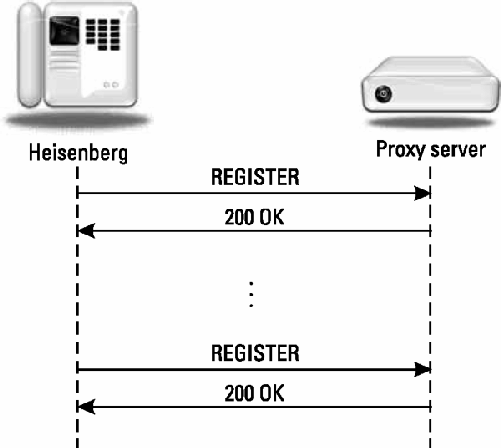

# Introduce to SIP

Often the best way to learn a protocol is to look at examples of its use. While the terminology, structures, and format of a new protocol can be confusing at first read, an example message flow can give a quick grasp of some of the key concepts of a protocol. The example message exchanges in this chapter will introduce SIP as defined by RFC 3261 [^1].

The first example shows the basic message exchange between two SIP devices to establish and tear down a session; the second example shows the message exchange when a SIP proxy server is used. The third example shows SIP registration, and the fourth shows a SIP presence and instant message example. The chapter concludes with a discussion of SIP message transmission using UDP, TCP, TLS, and SCTP. SIP transmission over Websocket is covered in [Chapter 19]().

The examples will be introduced using call flow diagrams between a called and calling party, along with the details of each message. Each arrow in the figures represents a SIP message, with the arrowhead indicating the direction of transmission. The thick lines in the figures indicate the media stream. In these examples, the media will be assumed to be RTP[^2] packets containing audio, but it could be another protocol. Details of RTP are covered in [Chapter 12]().

## 2.1	A Simple Session Establishment Example

 Figure[^Figure-2.1] shows the SIP message exchange between two SIP-enabled devices. The two devices could be SIP phones, phone clients running on a laptop or PC (known as softclients), tablets, or mobile phones. It is assumed that both devices are connected to an IP network such as the Internet and know each other’s IP address.

[^Figure-2.1 ]: Simple Session Establishment Example


The calling party, Tesla, begins the message exchange by sending a SIP INVITE message to the called party, Marconi. The INVITE contains the details of the type of session or call that is requested. It could be a simple voice (audio) session, a multimedia session such as a videoconference, or a gaming session. The INVITE message contains the following fields:

```ini
INVITE sip:Marconi@radio.example.org SIP/2.0
Via: SIP/2.0/UDP lab.high-voltage.example.org:5060;branch=z9hG4bKfw19b
Max-Forwards: 70
To: G. Marconi <sip:Marconi@radio.example.org>
From: Nikola Tesla <sip:n.tesla@high-voltage.example.org>;tag=76341
Call-ID: j2qu348ek2328ws
CSeq: 1 INVITE
Subject: About That Power Outage...
Contact: <sip:n.tesla@lab.high-voltage.example.org>
Content-Type: application/sdp
Content-Length: ...
v=0
o=Tesla 2890844526 2890844526 IN IP4
s=Phone Call
c=IN IP4 100.101.102.103
t=0 0
m=audio 49170 RTP/AVP 0
a=rtpmap:0 PCMU/8000
```

Since SIP is a text-encoded protocol, this is actually what the SIP message would look like “on the wire” as a UDP datagram being transported over, for example, Ethernet.

The fields listed in the INVITE message are called header fields. They have the form: 

```ini
Header: Value<CR><LF>
```

The first line of the request message, called the start line, lists the method, which is INVITE, the Request-URI, then the SIP version number (2.0), all separated by spaces. Each line of a SIP message is terminated by a Carriage Return Line Feed (CRLF). The Request-URI is a special form of SIP URI and indicates the resource to which the request is being sent, also known as the request target. SIP URIs are discussed in more detail in [Section 4.2]().

The first header field following the start line shown is a Via header field. Each SIP device that originates or forwards a SIP message stamps its own address in a Via header field, usually written as a host name that can be resolved into an IP address using a DNS query. The Via header field contains the SIP version number (`SIP/2.0`), a `/`, then `UDP` for UDP transport, a space, the hostname or address(`lab.high-voltage.example.org`), a colon, then a port number (in this example, the “well-known” SIP port number `5060`). Transport of SIP using TCP, UDP, TLS, and SCTP and the use of port numbers are covered later in this chapter. The branch parameter is a transaction identifier. Responses relating to this request can be correlated because they will contain this same transaction identifier.

The next header field shown is the Max-Forwards. It is initialized to some large integer and decremented by each SIP server, which receives and forwards the request, providing simple loop detection.

The next header fields are the To and From header fields, which show the originator and destination of the SIP request. SIP requests are routed based on the Request-URI instead of the To URI. This is because the Request-URI can be changed and rewritten as a request is forwarded, while the To URI generally stays the same. When a name label is used, as in this example, the SIP URI is enclosed in brackets <> (`name-label <SIP URL>`, in this example,`G. Marconi <sip:Marconi@radio.example.org>`  ). The name label could be displayed during alerting, for example, but is not used by the protocol.

The Call-ID header field is an identifier used to keep track of a particular SIP session. The originator of the request creates a locally unique string. Some older implementations also add an “@” and its host name to the string. In addition to the Call-ID, each party in the session also contributes a random identifier, unique for each call. These identifiers, called tags, are included in the To and From header fields as the session is established. The initial INVITE shown contains a From-tag but no To-tag.

The initiator of the session that generates the establishing INVITE generates the unique Call-ID and From-tag. In the response to the INVITE,the user agent answering the request will generate the To-tag. The combination of the local tag (contained in the From header field), remote tag (contained in the To header field), and the Call-ID uniquely identifies the established session, known as a dialog. This dialog identifier is used by both parties to identify this call because there could be multiple calls set up between them. Subsequent requests within the established session will use this dialog identifier, as will be shown in the following examples.

The next header field shown is the CSeq, or command sequence. It contains a number, followed by the method name, INVITE in this case. This number is incremented for each new request sent. In this example, the command sequence number is initialized to 1, but it could start at another integer value.

The Via header fields plus the Max-Forwards, To, From, Call-ID, and CSeq header fields represent the minimum required header field set in any SIP request message. Other header fields can be included as optional additional information or information needed for a specific request type. A Contact header field is also required in this INVITE message, which contains the SIP URI of Tesla’s communication device, known as a user agent (UA); this URI can be used to route messages directly to Tesla. The optional Subject header field is present in this example. It is not used by the protocol, but could be displayed during alerting to aid the called party in deciding whether to accept the call. The same sort of useful prioritization and screening commonly performed using the Subject and From header fields in an e-mail message is also possible with a SIP INVITE request.

The `Content-Type` and `Content-Length` header fields indicate that the message body is Session Description Protocol or SDP [^3]and contains 158 octets of data. The basis for the octet count of 158 is shown in Table 2.1, where the CR LF at the end of each line is shown as a ©® and the octet count for each line is shown on the right-hand side. A blank line separates the message body from the header field list, which ends with the Content-Length header field. In this case, there are seven lines of SDP data describing the media attributes that the caller Tesla desires for the call. This media information is needed because SIP makes no assumptions about the type of media session to be established—the caller must specify exactly what type of session (audio, video, gaming) that he wishes to establish. The SDP field names are listed in Table 2.2, and will be discussed in detail in [Chapter 13](), but a quick review of the lines shows the basic information necessary to establish a session.

​                         **Table2.1 Content-Length Calculation Example**

| Line                                                         | Total |
| :----------------------------------------------------------- | ----- |
| v=0©®                                                        | 05    |
| o=Tesla 2890844526 2890844526 IN IP4 lab.high-voltage.example.org©® | 66    |
| s=Phone Call©®                                               | 14    |
| c=IN IP4 100.101.102.103©®                                   | 26    |
| t=0 0©®                                                      | 07    |
| m=audio 49170 RTP/AVP 0©®                                    | 25    |
| a=rtpmap:0 PCMU/8000©®                                       | 22    |
|                                                              | 158   |

​				**Table2.2 The SDP field names**

| SDP Parameter                                                | Parameter Name |
| ------------------------------------------------------------ | -------------- |
| v=0                                                          | Version number |
| o=Tesla 2890844526 2890844526 IN IP4 lab.high-voltage.example.org | Origin         |
| s=-                                                          | Call Subject   |
| c=IN IP4 100.101.102.103                                     | Connection     |
| t=0 0                                                        | Time           |
| m=audio 49170 RTP/AVP 0                                      | Media          |
| a=rtpmap:0 PCMU/8000                                         | Attributes     |

Table 2.2 includes the:

- Connection IP address (100.101.102.103);
- Media format (audio);
- Port number (49170);
- Media transport protocol (RTP);
- Media encoding (PCM μ Law);
- Sampling rate (8,000 Hz).

INVITE is an example of a SIP request message. There are five other methods or types of SIP requests defined in the core SIP specification [RFC 3261](https://datatracker.ietf.org/doc/html/rfc3261) with others defined in extension RFCs, which update RFC 3261. The next message in [^Figure-2.1] is a 180 Ringing message sent in response to the INVITE. This message indicates that the called party, Marconi, has received the INVITE and that alerting is taking place. The alerting could be ringing a phone, a flashing message on a screen, or any other method of attracting the attention of the called party, Marconi.

The 180 Ringing is an example of a SIP response message. Responses are numerical and are classified by the first digit of the number. A 180 response is an informational class response , identified by the first digit being a `1`. Informational responses are used to convey noncritical information about the progress of the call. Many SIP response codes were based on HTTP version 1.1 [response codes](https://developer.mozilla.org/en-US/docs/Web/HTTP/Status) with some extensions and additions. Anyone who has ever browsed the World Wide Web has likely received a “404 Not Found” response from a Web server when a requested page was not found. 404 Not Found is also a valid SIP client error class response in a request to an unknown user. The other classes of SIP responses are covered in [Chapter 5]().

The response code number in SIP alone determines the way the response is interpreted by the server or the user. The reason phrase, Ringing in this case, is suggested in the standard, but any text can be used to convey more information. For instance, 180 Hold your horses, I’m trying to wake him up! is a perfectly valid SIP response and has the same meaning as a 180 Ringing response.

The 180 Ringing response has the following structure:

```ini
SIP/2.0 180 Ringing
Via: SIP/2.0/UDP lab.high-voltage.example.org:5060;branch=z9hG4bKfw19b;received=100.101.102.103
To: G. Marconi <sip:marconi@radio.example.org>;tag=a53e42
From: Nikola Tesla <sip:n.tesla@high-voltage.example.org>;tag=76341
Call-ID: j2qu348ek2328ws
CSeq: 1 INVITE
Contact: <sip:marconi@tower.radio.example.org>
Content-length: 0
```

The message was created by copying many of the header fields from the INVITE message, including the Via, To, From, Call-ID, and CSeq, and then adding a response start line containing the SIP version number, the response code, and the reason phrase. This approach simplifies the message processing for responses.

The Via header field contains the original `branch` parameter but also has an additional `received` parameter. This parameter contains the literal IP address that the request was received from (100.101.102.103), which typically is the same address that the URI in the Via resolves using DNS (lab.high-voltage.org).

Note that the To and From header fields are not reversed in the response message as one might expect them to be. Even though this message is sent to Marconi from Tesla, the header fields read the opposite. This is because **the To and From header fields in SIP are defined to indicate the direction of the request, not the direction of the message**. Since Tesla initiated this request, all responses to this INVITE will read To: Marconi From: Tesla.

The To header field now contains a tag that was generated by Marconi. All future requests and responses in this session or dialog will contain both the tag generated by Tesla and the tag generated by Marconi.

The response also contains a Contact header field, which contains an address at which Marconi can be contacted directly once the session is established.

When the called party, Marconi, decides to accept the call (i.e., the phone is answered), a 200 OK response is sent. This response also indicates that the type of media session proposed by the caller is acceptable. The 200 OK is an example of a success class response. The 200 OK message body contains Marconi’s media information:

```ini
SIP/2.0 200 OK
Via: SIP/2.0/UDP lab.high-voltage.example.org:5060;branch=z9hG4bKfw19b;received=100.101.102.103
To: G. Marconi <sip:marconi@radio.example.org>;tag=a53e42
From: Nikola Tesla <sip:n.tesla@high-voltage.org>;tag=76341
Call-ID: j2qu348ek2328ws
CSeq: 1 INVITE
Contact: <sip:marconi@tower.radio.example.org>
Content-Type: application/sdp
Content-Length: ...
v=0
o=Marconi 2890844528 2890844528 IN IP4 tower.radio.example.org
s=Phone Call
c=IN IP4 200.201.202.203
t=0 0
m=audio 60000 RTP/AVP 0
a=rtpmap:0 PCMU/8000
```

This response is constructed the same way as the 180 Ringing response and contains the same To tag and Contact URI. However, the media capabilities must be communicated in a SDP message body added to the response. From the same SDP fields as Table 2.2, the SDP contains:

- End-point IP address (200.201.202.203);
- Media format (audio);
- Port number (60000);
- Media transport protocol (RTP);
- Media encoding (PCM μ-Law);
- Sampling rate (8,000 Hz).

The final step is to confirm the media session with an acknowledgment request. The confirmation means that Tesla has successfully received Marconi’s response. This exchange of media information allows the media session to be established using another protocol: RTP in this example.

```ini
ACK sip:marconi@tower.radio.example.org SIP/2.0
Via: SIP/2.0/UDP lab.high-voltage.example.org:5060;branch=z9hG4bK321g
Max-Forwards: 70
To: G. Marconi <sip:marconi@radio.example.org>;tag=a53e42
From: Nikola Tesla <sip:n.tesla@high-voltage.example.org>;tag=76341
Call-ID: j2qu348ek2328ws
CSeq: 1 ACK
Content-Length: 0
```

The command sequence, CSeq, has the same number as the INVITE, but the method is set to ACK. At this point, the media session begins using the media information carried in the SIP messages. The media session takes place using another protocol, typically RTP. The branch parameter in the Via header field contains a newer transaction identifier than the INVITE, since an ACK sent to acknowledge a 200 OK is considered a separate transaction.

This message exchange shows that SIP is an end-to-end signaling protocol. A SIP network or SIP server is not required for the protocol to be used. Two end points running a SIP protocol stack and knowing each other’s IP addresses can use SIP to set up a media session between them. Although less obvious, this example also shows the client-server nature of the SIP protocol. When Tesla originates the INVITE request, he is acting as a SIP client. When Marconi responds to the request, he is acting as a SIP server. After the media session is established, Marconi originates the BYE request and acts as the SIP client, while Tesla acts as the SIP server when he responds. This is why a SIP-enabled device must contain both SIP user agent server and SIP user agent client software—during a typical session, both are needed. This is quite different from other client-server Internet protocols such as HTTP or FTP. The Web browser is always an HTTP client, and the Web server is always an HTTP server, and similarly for FTP. In SIP, an end point will switch back and forth during a session between being a client and a server.

In [^Figure-2.1], a BYE request is sent by Marconi to terminate the media session:

```ini
BYE sip:n.tesla@lab.high-voltage.example.org SIP/2.0
Via: SIP/2.0/UDP tower.radio.example.org:5060;branch=z9hG4bK392kf
Max-Forwards: 70
To: Nikola Tesla <sip:n.tesla@high-voltage.example.org>;tag=76341
From: G. Marconi <sip:marconi@radio.example.org>;tag=a53e42
Call-ID: j2qu348ek2328ws
CSeq: 1392 BYE
Content-Length: 0
```

The Via header field in this example is populated with Marconi’s host address and contains a new transaction identifier since the BYE is considered a separate transaction from the INVITE or ACK transactions shown previously. The To and From header fields reflect that this request is originated by Marconi, as they are reversed from the messages in the previous transaction. However, Tesla is able to identify the dialog using the presence of the same local and remote tags and Call-ID as the INVITE and tear down the correct media session.

Notice that all of the branch IDs shown in the example so far begin with the string `z9hG4bK`. This is a special string that indicates that the branch ID has been calculated using strict rules defined in RFC 3261 and is as a result usable as a tranaction identifier.  [^a1].

The confirmation response to the BYE is a 200 OK:

```ini
SIP/2.0 200 OK
Via: SIP/2.0/UDP tower.radio.example.org:5060;branch=z9hG4bK392kf;received=200.201.202.203
To: Nikola Tesla <sip:n.tesla@high-voltage.example.org>;tag=76341
From: G. Marconi <sip:marconi@radio.example.org>;tag=a53e42
Call-ID: j2qu348ek2328ws
CSeq: 1392 BYE
Content-Length: 0
```

The response echoes the CSeq of the original request: 1392 BYE. No ACK is sent since ACK is only sent in response to INVITE requests.

## 2.2	SIP Call with a Proxy Server

In the SIP message exchange of [^Figure-2.1], Tesla knew the IP address of Marconi and was able to send the INVITE directly to that address. This will not be the case in general—an IP address cannot be used like a telephone number. One reason is that IP addresses are often dynamically assigned due to the shortage of IPv4 addresses. Also, an IP address does not uniquely identify a user, but identifies a node on a particular physical IP network. You have one IP address at your office, another at home, and still another when you log on remotely while traveling. Ideally, there would be one address that would identify you wherever you are. In fact, there is an Internet protocol that does exactly that with e-mail. SMTP uses a host or system independent name (an e-mail address) that does not correspond to a particular IP address. It allows e-mail messages to reach you regardless of what your IP address is and where you are logged onto the Internet.

In addition, a request routed using only IP addresses will reach only one end point—only one device. Since communication is typically user-to-user instead of device-to-device, a more useful addressing scheme would allow a particular user to call another particular user, which would result in the request reaching the target user regardless of which device they are currently using, or if they have multiple devices.

SIP uses e-mail-like names for addresses. The addressing scheme is part of a family of Internet addresses known as URIs, as described in Section 1.4. SIP URIs can also handle telephone numbers, transport parameters, and a number of other items. A full description, including examples, can be found in Section 4.2. For now, the key point is that a SIP URI is a name that is resolved to an IP address by using a SIP proxy server and DNS lookups at the time of the call, as will be seen in the next example. [^Figure-2.2] shows an example of a more typical SIP call with a type of SIP server called a proxy server. In this example, the caller Schrodinger calls Heisenberg through a SIP proxy server. A SIP proxy operates in a similar way to a proxy in HTTP and other Internet protocols. A SIP proxy does not set up or terminate sessions, but sits in the middle of a SIP message exchange, receiving messages and forwarding them. This example shows one proxy, but there can be multiple proxies in a signaling path.

[^Figure-2.2]: SIP call example with a proxy server


SIP has two broad categories of URIs: ones that correspond to a user, and ones that correspond to a single device or end point. The user URI is known as an address of record (AOR), and a request sent to an address of record will require database lookups and service and feature operations, which can result in the request being sent to one or more end devices. A device URI is known as a contact, and typically does not require database lookups. An address of record URI is usually used in To and From header fields, as this is the general way to reach a person and is suitable for storing in address books and in returning missed calls. A device URI is usually used in a Contact header field and is associated with a particular user for a shorter period of time. The method of relating (or binding) a contact URI with an address of record URI will be discussed in Section 2.3.

Because Schrodinger does not know exactly where Heisenberg is currently logged on and what device he is currently using, a SIP proxy server is used to route the INVITE. First, a DNS lookup of Heisenberg’s SIP URI domain name (munich.example.org) is performed (see Section 2.6 for the details), which returns the IP `proxy.munich.example.org`, which handles that domain. The INVITE is then sent to that IP address:

```ini
INVITE sip:werner.heisenberg@munich.org SIP/2.0
Via: SIP/2.0/UDP 100.101.102.103:5060;branch=z9hG4bKmp17a
Max-Forwards: 70
To: Heisenberg <sip:werner.heisenberg@munich.example.org>
From: E. Schrodinger <sip:schroed5244@wave.example.org>;tag=42
Call-ID: 4827311-391-32934
CSeq: 1 INVITE Subject: Where are you exactly?
Contact: <sip:schroed5244@pc33.wave.example.org>
Content-Type: application/sdp
Content-Length: 159
v=0
o=schroed5244 2890844526 2890844526 IN IP4 100.101.102.103
s=Phone Call
t=0 0
c=IN IP4 100.101.102.103
m=audio 49170 RTP/AVP 0
a=rtpmap:0 PCMU/8000
```

The proxy looks up the SIP URI in the Request-URI (`sip:werner. heisenberg@munich.example.org`) in its database and locates Heisenberg. This completes the two-step process of:

1. DNS lookup by user agent to locate the IP address of the proxy. Database lookup is performed by the proxy to locate the IP address.
2. The INVITE is then forwarded to Heisenberg’s IP address with the addition of a second Via header field stamped with the address of the proxy.

```ini
INVITE sip:werner.heisenberg@200.201.202.203
Via: SIP/2.0/UDP proxy.munich.example.org:5060;branch=z9hG4bK83842.1
Via: SIP/2.0/UDP 100.101.102.103:5060;branch=z9hG4bKmp17a
Max-Forwards: 69
To: Heisenberg <sip:werner.heisenberg@munich.example.org>
From: E. Schrodinger <sip:schroed5244@wave.example.org>;tag=42
Call-ID: 4827311-391-32934
CSeq: 1 INVITE
Contact: <sip:schroed5244@pc33.wave.example.org>
Content-Type: application/sdp
Content-Length: 159
v=0
o=schroed5244 2890844526 2890844526 IN IP4 100.101.102.103
s=Phone Call
c=IN IP4 100.101.102.103
t=0 0 m=audio 49172 RTP/AVP 0
a=rtpmap:0 PCMU/8000
```

From the presence of two Via header fields, Heisenberg knows that the INVITE has been routed through a proxy server. Having received the INVITE, a 180 Ringing response is sent by Heisenberg to the proxy:

```ini
SIP/2.0 180 Ringing
Via: SIP/2.0/UDP proxy.munich.example.org:5060;branch=z9hG4bK83842.1;received=100.101.102.105
Via: SIP/2.0/UDP 100.101.102.103:5060;branch=z9hG4bKmp17a
To: Heisenberg <sip:werner.heisenberg@munich.example.org>;tag=314159
From: E. Schrodinger <sip:schroed5244@wave.example.org>;tag=42
Call-ID: 4827311-391-32934
CSeq: 1 INVITE
Contact: <sip:werner.heisenberg@200.201.202.203>
Content-Length: 0
```

Again, this response contains the Via header fields, and the To, From, Call-ID, and CSeq header fields from the INVITE request. The response is then sent to the address in the first Via header field, `proxy.munich.example.org` to the port number listed in the Via header field: `5060`, in this case. Notice that the To header field now has a tag added to it to identify this particular dialog. Only the first Via header field contains a received parameter, since the second Via header already contains the literal IP address in the URI. The Contact header field contains the device URI of Heisenberg, and there is no NAT in between.

The proxy receives the response, checks that the first Via header field has its own address (proxy.munich.example.org), uses the transaction identifier in the Via header to locate the transaction, removes that Via header field, then forwards the response to the address in the next Via header field: IP address 100.101.102.103, port 5060. The resulting response sent by the proxy to Schrodinger is:

```ini
SIP/2.0 180 Ringing
Via: SIP/2.0/UDP 100.101.102.103:5060;branch=z9hG4bKmp17a
To: Heisenberg <sip:werner.heisenberg@munich.example.org>;tag=314159
From: E. Schrodinger <sip:schroed5244@wave.example.org>;tag=42
Call-ID: 4827311-391-32934
CSeq: 1 INVITE
Contact: <sip:werner.heisenberg@200.201.202.203>
Content-Length: 0
```

The use of Via header fields in routing and forwarding SIP messages reduces complexity in message forwarding. The request required a database lookup by the proxy to be routed. The response requires no lookup because the routing is imbedded in the message in the Via header fields. This ensures that responses route back through the same set of proxies as the request. The call is accepted by Heisenberg, who sends a 200 OK response:

```ini
SIP/2.0 200 OK
Via: SIP/2.0/UDP proxy.munich.example.org:5060;branch=z9hG4bK83842.1;received=100.101.102.105
Via: SIP/2.0/UDP 100.101.102.103:5060;branch=z9hG4bKmp17a
To: Heisenberg <sip:werner.heisenberg@munich.example.org>;tag=314159
From: E. Schrodinger <sip:schroed5244@wave.example.org>;tag=42
Call-ID: 4827311-391-32934
CSeq: 1 INVITE
Contact: <sip:werner.heisenberg@200.201.202.203>
Content-Type: application/sdp
Content-Length: 159
v=0
o=heisenberg 2890844526 2890844526 IN IP4 200.201.202.203
s=Phone Call
c=IN IP4 200.201.202.203
t=0 0 m=audio 49172 RTP/AVP 0
a=rtpmap:0 PCMU/8000
```

The proxy forwards the 200 OK message to Schrodinger after removing the first Via header field:

```ini
SIP/2.0 200 OK Via: SIP/2.0/UDP 100.101.102.103:5060;branch=z9hG4bKmp17a
To: Heisenberg <sip:werner.heisenberg@munich.example.org>;tag=314159
From: E. Schrodinger <sip:schroed5244@wave.example.org>;tag=42
Call-ID: 4827311-391-32934
CSeq: 1 INVITE
Contact: <sip:werner.heisenberg@200.201.202.203>
Content-Type: application/sdp
Content-Length: 159
v=0
o=heisenberg 2890844526 2890844526 IN IP4 200.201.202.203
s=phone call
c=IN IP4 200.201.202.203
t=0 0
m=audio 49170 RTP/AVP 0
a=rtpmap:0 PCMU/8000
```

The presence of the Contact header field with the SIP URI address of Heisenberg in the 200 OK allows Schrodinger to send the ACK directly to Heisenberg, bypassing the proxy. (Note that the Request-URI is set to Heisenberg’s Contact URI and not the URI in the To header field.) This request and all future requests continue to use the tag in the To header field:

```
ACK sip:werner.heisenberg@200.201.202.203
Via: SIP/2.0/UDP 100.101.102.103:5060;branch=z9hG4bKka42
Max-Forwards: 70
To: Heisenberg <sip:werner.heisenberg@munich.example.org>;tag=314159
From: E. Schrodinger <sip:schroed5244@wave.example.org>;tag=42
Call-ID: 4827311-391-32934
CSeq: 1 ACK
Content-Length: 0
```

This shows that the proxy server is not really “in the call.” It facilitates the two end points locating and contacting each other, but it can drop out of the signaling path as soon as it no longer adds any value to the exchange. This role of helping the two user agents locate each other is sometimes called rendezvous and is a key function of the SIP protocol. A proxy server can force further messaging to route through it by inserting a Record-Route header field, which is described in Section 6.1.23. In addition, it is possible to have a proxy server that does not retain any knowledge of the fact that there is a session established between Schrodinger and Heisenberg (referred to as call state information). This is discussed in Section 2.3.1. Note that the media is always end-to-end and not through the proxy.

In SIP the path of the signaling messages is totally independent of the path of the media. In telephony, this is described as the separation of control channel and bearer channel.

The media session is ended when Heisenberg sends a BYE message:

```ini
BYE sip:schroed5244@pc33.wave.org SIP/2.0
Via: SIP/2.0/UDP 200.201.202.203:5060;branch=z9hG4bK4332
Max-Forwards: 70
To: E. Schrodinger <sip:schroed5244@wave.example.org>;tag=42
From: Heisenberg <sip:werner.heisenberg@munich.example.org> ;tag=314159
Call-ID: 4827311-391-32934
CSeq: 2000 BYE
Content-Length: 0
```

Note that Heisenberg’s CSeq was initialized to 2000. Each SIP device maintains its own independent CSeq number space. This is explained in some detail in Section 6.1.5. The Request-URI is set to Schrodinger’s Contact URI. Schrodinger confirms with a 200 OK response:

```ini
SIP/2.0 200 OK
Via: SIP/2.0/UDP 200.201.202.203:5060;branch=z9hG4bK4332
To: E. Schrodinger <sip:schroed5244@wave.example.org>;tag=42
From: Heisenberg <sip:werner.heisenberg@munich.example.org> ;tag=314159
Call-ID: 4827311-391-32934
CSeq: 2000 BYE
Content-Length: 0
```

Not discussed in the previous example is the question of how the database accessed by the proxy contained Heisenberg’s current IP address. There are many ways this could be done using SIP or other protocols. The mechanism for accomplishing this using SIP is called registration and is discussed in the next section.

## 2.3	SIP Registration Example

In this example, shown in [^Figure-2.3], Heisenberg sends a SIP REGISTER request to a type of SIP server known as a registrar server. The SIP registrar server receives the message and uses the information in the request to update the database used by proxies to route SIP requests. Contained in the REGISTER message To header is the SIP URI address of Heisenberg. This is Heisenberg’s well-known address, perhaps printed on his business card or published on a Web page or in a directory. Also contained in the REGISTER is a Contact URI, which represents the current device (and its IP address) that the user Heisenberg is currently using. The registrar binds the SIP URI of Heisenberg and the IP address of the device in a database that can be used, for example, by the proxy server in [^Figure-2.2] to locate Heisenberg. When a proxy server with access to the database receives an INVITE request addressed to Heisenberg’s URI (i.e., an incoming call), the request will be proxied to the Contact URI of the currently registered device.

This registration has no real counterpart in the telephone network, but it is very similar to the registration a wireless phone performs when it is turned on. A mobile phone sends its identity to the base station (BS), which then forwards the location and phone number of the mobile phone to a home location register (HLR). When the mobile switching center (MSC) receives an incoming call, it consults the HLR to get the current location of the mobile phone. Further aspects of SIP mobility are discussed in [Chapter 7]().

[^Figure-2.3]: SIP registration example.



The REGISTER message sent by Heisenberg to the SIP registrar server has the form:

```ini
REGISTER sip:registrar.munich.org SIP/2.0
Via: SIP/2.0/UDP 200.201.202.203:5060;branch=z9hG4bKus19
Max-Forwards: 70
To: Werner Heisenberg <sip:werner.heisenberg@munich.example.org>
From: Werner Heisenberg <sip:werner.heisenberg@munich.example.org> ;tag=3431
Call-ID: 73764291
CSeq: 1 REGISTER
Contact: sip:werner.heisenberg@200.201.202.203
Content-Length: 0
```

The Request-URI in the start line of the message contains the address of the registrar server. In a REGISTER request, the To header field contains the URI that is being registered, in this case `sip:werner.heisenberg@munich.example.org`. This results in the To and From header fields usually being the same, although an example of third-party registration is given in [Section 4.1.2](). The SIP URI in the Contact address is stored by the registrar.

The registrar server acknowledges the successful registration by sending a 200 OK response to Heisenberg. The response echoes the Contact information that has just been stored in the database and includes a To tag:

```ini
SIP/2.0 200 OK
Via: SIP/2.0/UDP 200.201.202.203:5060;branch=z9hG4bKus19
To: Werner Heisenberg <sip:werner.heisenberg@munich.example.org>;tag=8771
From: Werner Heisenberg <sip:werner.heisenberg@munich.example.org>;tag=3431
Call-ID: 73764291
CSeq: 1 REGISTER
Contact: <sip:werner.heisenberg@munich.org>;expires=3600
Content-Length: 0
```

The Contact URI is returned along with an expires parameter, which indicates how long the registration is valid (in this case, 1 hour, or 3,600 seconds). If Heisenberg wants the registration to be valid beyond that interval, he must send another REGISTER request within the expiration interval.

Registration is typically performed automatically on initialization of a SIP device and at regular intervals determined by the expiration interval chosen by the registrar server. Registration is an additive process—more than one device can be registered against a SIP URI. If more than one device is registered, a proxy may forward the request to either or both devices in a sequential or parallel search. Additional register operations can be used to clear registrations or retrieve a list of currently registered devices.


## 2.4	SIP Presence and Instant Message Example

This example shows how SIP is used in a presence and instant messaging application. Presence information can be thought of as the state of a user or device, or willingness to communicate at a particular instant. It can be as simple as whether a particular user is signed in or not, whether they are active at their station, or idle or away. For a mobile device, presence information can include the actual location in terms of coordinates, or in general terms such as “in the office,” “traveling,” or “in the lab.” Presence information can even include information about the status or mood of the user, whether they are working, relaxing, or socializing. For all these examples, a presence protocol is mainly concerned about establishing subscriptions or long-term relationships between devices about transferring status information, and the delivery of that information. The actual information transferred, and how that information is presented to the user, is application dependent. In terms of the SIP, SUBSCRIBE is used to request status or presence updates from the presence server (or presentity), and NOTIFY is used to deliver that information to the requestor or presence watcher. SIP presence uses the SIP Events extensions ([^4] ,[^5]).

[^Figure-2.4]: SIP presence and instance messaging example


In this example, Chebyshev wishes to communicate with Poisson. The message flow is shown in [^Figure-2.4]. To find out the status of Poisson, Chebyshev subscribes to Poisson’s presence information by sending a SUBSCRIBE message to Poisson. The request looks like:

```ini
SUBSCRIBE sip:poisson@probability.example.org SIP/2.0
Via SIP/2.0/TCP lecturehall21.academy.ru.example.com:5060;branch=z9hG4bK348471123
Max-Forwards: 70
To: M. Poisson <sip:poisson@probability.example.org>
From: P. L. Chebyshev <sip:Chebyshev@academy.ru.example.com>;tag=21171
Call-ID: 58dkfj34924lk34452k592520
CSeq: 3412 SUBSCRIBE
Allow-Events: presence
Allow: ACK, INVITE, CANCEL, BYE, NOTIFY, SUBSCRIBE, MESSAGE
Contact: <sip:pafnuty@lecturehall21.academy.ru.example.com:37129;transport=tcp>
Event: presence
Content-Length: 0
```

In this example, TCP is used as the transport for the SIP messages as indicated in the Via header field and in the transport=tcp parameter in the Contact URI. Also note that a nondefault port number, port 37129, is used for this Contact URI. This request also contains Allow and Allow-Events header fields, which are used to advertise capabilities. In this example, Chebyshev is indicating support for receiving seven methods listed in the Allow header field, and also presence subscriptions in the Allow-Event header field. As this SUBSCRIBE is creating a dialog (in an analogous way that an INVITE created a dialog in the earlier examples), the From contains a tag but the To header field does not yet contain a tag.

Poisson accepts the subscription request by sending a 200 OK response back to Chebyshev:

```ini
SIP/2.0 200 OK Via SIP/2.0/TCP lecturehall21.academy.ru.example.com:5060;branch=z9hG4bK348471123;received=19.34.3.1
To: M. Poisson <sip:poisson@probability.example.org>;tag=25140
From: P. L. Chebyshev <sip:Chebyshev@academy.ru.example.com>;tag=21171
Call-ID: 58dkfj34924lk34452k592520
CSeq: 3412 SUBSCRIBE
Allow-Events: dialog, presence
Allow: ACK, INVITE, CANCEL, BYE, NOTIFY, SUBSCRIBE, MESSAGE
Contact: <sip:s.possion@dist.probability.example.org;transport=tcp>
Event: presence Expires: 3600
Content-Length: 0
```

In this example, there are no proxy servers between Chebyshev’s watcher and Poisson’s presence server, although there could be any number. The Expires header field indicates that the subscription expires in 1 hour. The actual subscription is begun by Poisson sending the first NOTIFY back to Chebyshev:

```ini
NOTIFY sip:pafnuty@lecturehall21.academy.ru.example.com:37129 SIP/2.0
Via SIP/2.0/TCP dist.probablilty.example.org:5060;branch=z9hG4bK4321
Max-Forwards: 70
To: P. L. Chebyshev <sip:Chebyshev@academy.ru.example.com>;tag=21171
From: M. Poisson <sip:poisson@probability.example.org>;tag=25140
Call-ID: 58dkfj34924lk34452k592520
CSeq: 1026 NOTIFY
Allow: ACK, INVITE, CANCEL, BYE, NOTIFY, SUBSCRIBE, MESSAGE
Allow-Events: dialog, presence
Contact: <sip:s.possion@dist.probability.example.org;transport=tcp>
Subscription-State: active;expires=3600
Event: presence
Content-Type: application/pidf+xml
Content-Length: ...

<?xml version=”1.0” encoding=”UTF-8”?> <presence xmlns=”urn:ietf:params:xml:ns:pidf” entity=”sip:poisson@probability.example.org”>
	<tuple id=”452426775”>
		<status>
			<basic>closed</basic>
		</status>
	</tuple>
</presence>
```

Note that this NOTIFY is sent within the dialog established with the SUBSCRIBE—it uses the same dialog identifier (Call-ID, local and remote tags)—and the request is sent to the Contact URI provided by Chebyshev in the subscription request. The Subscription-State header field indicates that the subscription has been authorized and activated and that it will expire in 1 hour unless refreshed by Chebyshev (using another SUBSCRIBE request).

The Common Presence and Instant Message Presence Information Data Format (CPIM PIDF) [^6] XML message body contains the status information that Poisson is currently off-line (closed).

Chebyshev sends a 200 OK response to the NOTIFY to confirm that it has been received:

```ini
SIP/2.0 200 OK Via SIP/2.0/TCP dist.probablilty.example.org:5060;branch=z9hG4bK4321;received=24.32.1.3
To: P. L. Chebyshev <sip:Chebyshev@academy.example.ru.exmaple.com>;tag=21171
From: M. Poisson <sip:poisson@probability.example.org>;tag=25140
Call-ID: 58dkfj34924lk34452k592520
CSeq: 1026 NOTIFY
Content-Length: 0
Later, when Poisson does sign in, this information is provided in a second NOTIFY containing the change in status:
NOTIFY sip:pafnuty@lecturehall21.academy.ru.example.com SIP/2.0
Via SIP/2.0/TCP dist.probablilty.example.org:5060;branch=z9hG4bK334241
Max-Forwards: 70
To: P. L. Chebyshev <sip:Chebyshev@academy.ru.example.com>;tag=21171
From: M. Poisson <sip:poisson@probability.example.org>;tag=25140
Call-ID: 58dkfj34924lk34452k592520
CSeq: 1027 NOTIFY Allow: ACK, INVITE, CANCEL, BYE, NOTIFY, SUBSCRIBE, MESSAGE
Allow-Events: presence
Contact: <sip:s.possion@dist.probability.example.org;transport=tcp>
Subscription-State: active;expires=1800
Event: presence
Content-Type: application/pidf+xml
Content-Length: ...
<?xml version=”1.0” encoding=”UTF-8”?>
<presence xmlns=”urn:ietf:params:xml:ns:pidf” entity=”sip:poisson@probability.
example.org”>
	<tuple id=”452426775”>
		<status>
			<basic>open</basic>
		</status>
		<contact>sip:s.possion@dist.probability.example.org;transport=tcp</contact>
	</tuple>
</presence>
```

The expiration time indicated in the Subscription-State header field indicates that 30 minutes have passed since the subscription was established. The CPIM PIDF XML message body now indicates that Poisson is online (open) and can be reached via the URI:

```ini
sip:s.possion@dist.probability.example.org;transport=tcp
Chebyshev confirms receipt of the NOTIFY with a 200 OK response:
SIP/2.0 200 OK Via SIP/2.0/TCP dist.probablilty.example.org:5060;branch=z9hG4bK334241;received=24.32.1.3
To: P. L. Chebyshev <sip:Chebyshev@academy.ru.example.com>;tag=21171
From: M. Poisson <sip:poisson@probability.example.org>;tag=25140
Call-ID: 58dkfj34924lk34452k592520
CSeq: 1027 NOTIFY
Content-Length: 0
```

Now that Chebyshev knows that Poisson is online, he sends an instant message to him using the Contact URI from the NOTIFY:

```ini
MESSAGE sip:s.possion@dist.probability.example.org SIP/2.0
Via SIP/2.0/TCP lecturehall21.academy.ru.example.com:5060;branch=z9hG4bK3gtr2 Max-Forwards: 70
To: M. Poisson <sip:s.possion@dist.probability.example.org>
From: P. L. Chebyshev <sip:Chebyshev@academy.ru.example.com>;tag=4542
Call-ID: 9dkei93vjq1ei3
CSeq: 15 MESSAGE Allow: ACK, INVITE, CANCEL, BYE, NOTIFY, SUBSCRIBE, MESSAGE
Content-Type: text/plain
Content-Length: 11
Hi There!
```

Notice that this MESSAGE is sent outside the dialog. Instant messages sent using the MESSAGE method in SIP are like messages—they are not part of any dialog. As a result, each message contains a new Call-ID and From tag. The 200 OK response is used to acknowledge receipt of the instant message.

```ini
SIP/2.0 200 OK Via SIP/2.0/TCP lecturehall21.academy.ru.example.com:5060;branch=z9hG4bK3gtr2;received=19.34.3.1
To: M. Poisson <sip:s.possion@dist.probability.example.org>;tag=2321
From: P. L. Chebyshev <sip:Chebyshev@academy.ru.example.com>;tag=4542
Call-ID: 9dkei93vjq1ei3
CSeq: 15 MESSAGE
Content-Length: 0
```

Poison answers with a reply, which is also sent outside of any dialog, with a new Call-ID and From tag (an instant message response is never sent in a 200 OK reply to a MESSAGE request).

```ini
MESSAGE sip:Chebyshev@academy.ru.example.com SIP/2.0
Via SIP/2.0/TCP dist.probablilty.example.org:5060;branch=z9hG4bK4526245
Max-Forwards: 70
To: P. L. Chebyshev <sip:Chebyshev@academy.ru.example.com>
From: M. Poisson <sip:s.possion@dist.probability.example.org> ;tag=14083
Call-ID: lk34452k592520
CSeq: 2321 MESSAGE Allow: ACK, INVITE, CANCEL, BYE, NOTIFY, SUBSCRIBE, MESSAGE
Content-Type: text/plain
Content-Length: 26
Well, hello there to you, too!
```

This receives a 200 OK reply:

```ini
SIP/2.0 200 OK Via SIP/2.0/TCP dist.probablilty.example.org:5060 ;branch=z9hG4bK4 526245;received=24.32.1.3
To: P. L. Chebyshev <sip:Chebyshev@academy.ru.example.com> ;tag=mc3bg5q77wms
From: M. Poisson <sip:s.possion@dist.probability.example.org>; tag=14083
Call-ID: lk34452k592520
CSeq: 2321 MESSAGE
Content-Length: 0
```

Other presence packages define other sets of information that can be requested by watchers from presence servers. Further examples of SIP presence and instant messaging can be found in [Chapter 8]().


## 2.5	Message Transport

As discussed in [Chapter 1](), SIP is an application layer protocol in the Internet Multimedia Protocol stack shown in Figure 1.1. RFC 3261 defines the use of TCP, UDP, or TLS transport. An extension document describes how SCTP can be used. How a SIP message is transported using these four protocols will be described in the following sections. The compression of SIP for transport over low bandwidth connections, such as wireless, is discussed in [Chapter 7]().

### 2.5.1	UDP Transport

When using UDP, each SIP request or response message is carried in a single UDP datagram or packet. For a particularly large message body, there is a compact form of SIP that saves space in representing some header fields with a single character. This is discussed in [Chapter 6](). Figure-2.5 shows a SIP BYE request exchange during an established SIP session using UDP.

[^Figure-2.5]:Transmission-of-a-SIP-message-using-UDP


The source port is chosen from a pool of available port numbers (above 49172), or the default SIP port of 5060 can be used. The lack of handshaking or acknowledgment in UDP transport means that a datagram could be lost along with a SIP message. However, the checksum enables UDP to discard errored datagrams, allowing SIP to assume that a received message is complete and error-free. The reliability mechanisms built into SIP to handle message retransmissions are described in Section 3.7. The reply is also sent to port 5060, or the port number listed in the top Via header field.

UDP provides the simplest transport for user agents and servers and allows them to operate without the transport layer state. However, UDP offers no congestion control. A series of lost packets on a heavily loaded IP link can cause retransmissions, which in turn produce more lost packets and can push the link into congestion collapse. Also, UDP may only be used for SIP when the message (and its response) is known to be less than the Message Transport Unit (MTU) size of the IP network. For simple SIP messages, this is not a problem. However, for large messages containing multiple message bodies and large header fields, this can be a problem. In this case, TCP must be used, since SIP does not support fragmentation at the SIP layer.

### 2.5.2	TCP Transport

TCP provides a reliable transport layer, but at a cost of complexity and transmission delay over the network. The use of TCP for transport in a SIP message exchange is shown in [^Figure-2.6]. This example shows an INVITE sent by a user agent at 100.101.103.103 to a type of SIP server called a redirect server at 200.201.202.203. A SIP redirect server does not forward INVITE requests like a proxy, but looks up the destination address and instead returns that address in a redirection class (3xx) response. The 302 Moved Temporarily response is acknowledged by the user agent with an ACK message. Not shown in this figure is the next step, where the INVITE would be resent to the address returned by the redirect server. As in the UDP example, the well-known SIP port number of 5060 is chosen for the destination port, and the source port is chosen from an available pool of port numbers. However, before the message can be sent, the TCP connection must be opened between the two end points. This transport layer datagram exchange is shown in Figure-2.6 as a single arrow, but it is actually a three-way handshake between the end points as shown in Figure 1.2. Once the connection is established, the messages are sent in the stream.

The Content-Length header field is critical when TCP is used to transport SIP, since it is used to find the end of one message and the start of the next. When TCP or another stream-based transport is used, Content-Length is a required header field in all requests and responses.

[^Figure-2.6]:Transmission-of-a-SIP-message-using-TCP


To send the 302 Moved Temporarily response, the server typically opens a new TCP connection in the reverse direction, using 5060 (or the port listed in the top Via header field) as the destination port. The acknowledgment ACK is sent in the TCP stream used for the INVITE. Because this concludes the SIP session, the connection is then closed. If a TCP connection closes during a dialog, a new one can be opened to send a request within the dialog, such as a BYE request to terminate the media session.

As previously mentioned, TCP provides reliable transport and congestion control. It can also transport SIP messages of arbitrary sizes. The disadvantages of TCP include the setup delay in establishing the connection and the need for servers to maintain this connection state at the transport layer.

### 2.5.3	TLS Transport

SIP can use TLS[^7] over TCP the same way as for encrypted transport, with the additional capabilities of authentication. In Section 4.2.1 the secure SIP URI scheme (sips) will be discussed, which uses TLS transport. The default SIP port number for TLS transport is port 5061.

If TLS is used between two proxies, each proxy may have a certificate allowing mutual authentication. However, if a client does not have a certificate, TLS can be used in conjunction with another authentication mechanism, such as SIP digest, to allow mutual authentication.

The SIP use of TLS takes advantage of both the encryption and authentication services. However, the encryption and authentication are only useful on a single hop. If a SIP request takes multiple hops (i.e., includes one or more proxy servers), TLS is not useful for end-to-end authentication. SIP proxies must support TLS and will likely use TLS for long-lived connections. TLS will be covered more in Chapter 14.

### 2.5.4	SCTP Transport

An extension to SIP defines the use of SCTP [^8] with SIP to provide reliable stream-based transport with some advantages over TCP transport for a message-based protocol such as SIP. First, it has built-in message segmentation, so that individual SIP messages are separated at the transport layer. With TCP, the SIP protocol must use the Content-Length calculation to delineate messages. If a TCP connection is being shared by a number of SIP transactions and dialogs, the “head of line blocking” problem discussed in Section 1.2.4.5 can cause the buffer to contain valid SIP messages that could be processed by the server while the retransmission takes place. Due to its message level delineation, SCTP is able to continue to forward messages to the application layer while simultaneously requesting a retransmission of a dropped message. Note that this is only a problem when multiple applications are multiplexed over a single TCP connection. An example of this is a TCP link between two signaling proxy servers. For a user agent to proxy TCP connection, this is usually not a problem unless the two have many simultaneous dialogs established.

SCTP also supports multihoming, so if one of a pair of load balancing SIP proxies fails, the other can immediately begin receiving the messages without even requiring a DNS or other database lookup. The SIP usage of SCTP is described in [^9].

## 2.6	Transport Protocol Selection

Since SIP supports multiple transport protocols, it must have a way of managing them. The full SIP usage of DNS is defined in [^10], but the basic steps for a client are listed here. There are two ways that this is achieved. 

The first is through explicit indications in a SIP URI. The presence of a `transport=tcp` or `transport=sctp` [^9] indicates that the particular transport protocol should be used for this URI. Note that for TLS transport, the SIPS URI scheme should be used, although some implementations use the nonstandard `transport=tls` parameter. UDP is used if `transport=udp` is included. 

When no transport parameter is included, the following rules are followed:

1. If the URI has a numeric IP address, then UDP should be used for a SIP URI and TCP for a SIPS URI.
2. If the URI does not have a numeric address but has a numeric port number, then UDP should be used for a SIP URI and TCP for a SIPS URI.
3. If the URI does not have a numeric IP address or port, and NAPTR DNS queries are supported, then a DNS NAPTR query should be performed on the host part of the URI. The NAPTR service fields are “`SIP+D2U`” for UDP, “`SIP+D2T`” for TCP, and “`SIP+D2S`” for SCTP transport. The result of the NAPTR regex replacement will be a URI, which is used for an SRV lookup described in the next step. The preference field indicates the relative preference if multiple transports are supported. If no NAPTR records are returned, an SRV query should be performed.
4. The SIP usage of DNS SRV records uses “`_sip`” or “`_sips`” for the protocol and “`_udp`”, “`_tcp`”, and “`_sctp`” for UDP, TCP, and SCTP transports. The results of the SRV query will be a target hostname and port number. The request should be sent to that address and port. Full details on SRV record usage are in [^11].
5. If no SRV records are found, then an address query for A or an AAAA DNS query should be performed, and UDP should be used for a SIP URI and TCP for a SIPS URI.

A slightly different set of rules are followed by proxy servers, as described in [^10].

For example, consider the DNS lookup performed by Schrodinger in [^Figure-2.2]. The URI is `sip:werner.heisenberg@munich.example.org`, which does not contain a numeric IP address or port, so steps 1 and 2 are not followed. Schrodinger then follows step 3 and performs a NAPTR query on munich.example.com which returns the following record:

```ini
munich.example.com. 360 IN NAPTR 100 50 “s” “SIPS+DTU” “” _sip._udp.munich.example.com
```

Since only UDP transport is supported, step 4 results in an SRV query on `_sip._udp.munich.example.de`, which returns the following record:

```ini
_sip._udp.munich.example.com. 300 IN SRV 0 100 5060 proxy.munich.example.com
```

Finally, an A lookup is performed on `proxy.munich.example.com` which returns:

```ini
proxy.munich.example.com.3600 IN A 100.101.102.105
```

As a result, Schrodinger sends the INVITE to `100.101.102.105:5060` as shown in [^Figure-2.2].


## 2.7	Conclusion

This chapter introduced the SIP using some common call flow examples including a basic call, call through a proxy server, registration, and presence and instant messaging. The next chapter will explore further the details of SIP and the behavior or standard elements such as user agents, proxies, redirect servers, and registrars.


## 2.8	Questions

Q2.1 Define a SIP dialog.

Q2.2 What SIP parameter carries the SIP transaction identifier?

Q2.3 Compare proxy, registrar, and redirect servers.

Q2.4 Which SIP methods create dialogs? Which SIP methods end dialogs?

Q2.5 Explain the purpose of the Contact header field in an INVITE.

Q2.6 Is the Content-Length header field mandatory for TCP transport? Why or why not?

Q2.7 What is the purpose of Via header fields?

Q2.8 The DNS application Dig has returned the following values. What are the three types of DNS Resource returned? Explain the meaning of each field of the record for `_sip._tcp.iptel.example.org`. What IP address and port would a SIP request (Service = sip) be sent to at the `iptel.example.org` domain, assuming TCP transport (Proto=tcp)?

```shell
$ dig _sip._tcp.iptel.example.org in srv
; <<>> DiG 9.3.4 <<>> _sip._tcp.iptel.example.org in srv ;; global
options: printcmd ;; Got answer: ;; ->>HEADER<<- opcode: QUERY,
status: NOERROR, id: 15807 ;; flags: qr rd ra; QUERY: 1, ANSWER: 1,
AUTHORITY: 5, ADDITIONAL: 5
;; QUESTION SECTION: ;_sip._tcp.iptel.example.org. IN SRV
;; ANSWER SECTION:

;; SERVER: 192.168.0.1#53(192.168.0.1) ;; WHEN: Wed Feb 6 09:56:07 2008
;; MSG SIZE rcvd: 248
```

Q2.9 Explain the difference between the Request-URI and the To URI in a SIP INVITE.

Q2.10 Explain the meaning of each of the parameters in the following Via header field:

```ini
Via: SIP/2.0/SCTP room42.lib.example.org:4213 ;branch=z9hG4bK3423;received=13.34.3.1
```


## References

[^1]: Rosenberg, J., H. Schulzrinne, G. Camarillo, A. Johnston, J. Peterson, R. Sparks, M. Handley, and E. Schooler, “SIP: Session Initiation Protocol,” [RFC 3261](https://datatracker.ietf.org/doc/html/rfc3261), June 2002.
[^2]: Schulzrinne, H., et al., “RTP: A Transport Protocol for Real-Time Applications,” STD 64, [RFC 3550](), July 2003.gb
[^3]: Handley, M., V. Jacobson, and C. Perkins, “SDP: Session Description Protocol,” [RFC 4566](https://tools.ietf.org/html/rfc4566), July 2006.
[^4]: Roach, A., “SIP—Specific Event Notification,” [RFC 6665](https://datatracker.ietf.org/doc/html/rfc6665), July 2012.
[^5]: Campbell, B., et al., “Session Initiation Protocol (SIP) Extension for Instant Messaging,” [RFC 3428](https://datatracker.ietf.org/doc/html/rfc3428), December 2002.
[^6]: Sugano, H., et al., “Presence Information Data Format (PIDF),” [RFC 3863](https://datatracker.ietf.org/doc/html/rfc3863), August 2004.
[^7]: Dierks, T., and E. Rescorla, “The TLS Protocol Version 1.2,” [RFC 5246](https://tools.ietf.org/html/rfc5246), August 2008.
[^8]: Stewart, R., et al., “Stream Control Transmission Protocol,” [RFC 4960](https://datatracker.ietf.org/doc/html/rfc4960), September 2007.
[^9]:  Rosenberg, J., H. Schulzrinne, and G. Camarillo, “The Stream Control Transmission Protocol (SCTP) as a Transport for the Session Initiation Protocol (SIP),” [RFC 4168](https://tools.ietf.org/html/rfc4168), October 2005.
[^10]: Rosenberg, J., and H. Schulzrinne, “Session Initiation Protocol (SIP): Locating SIP Servers,” [RFC 3263](https://datatracker.ietf.org/doc/html/rfc3263), June 2002.
[^11]: Gulbrandsen, A., P. Vixie, and L. Esibov, “A DNS RR for Specifying the Location of Services (DNS SRV),” [RFC 2782](https://tools.ietf.org/html/rfc2782), February 2000.


## Annotations

[^a1]: This string is needed because branch IDs generated by user agents prior to RFC 3261 may have constructed branch IDs which are not suitable as transaction identifiers. In this case, a client must construct its own transaction identifier using the To tag, From tag, Call-ID, and CSeq.


## Notes

### Identifiers in SIP

- Session(Dialog) Identifier
  - - `Call-ID`   an identifier used to keep track of a particular SIP session
    - `From: tag=` 
    - `To: tag=`
  - Transaction Identifier
    - `via: branch=`    Responses relating to this request can be correlated because they will contain this same transaction identifier
  - Command Sequence Number
    - `CSeq`  

