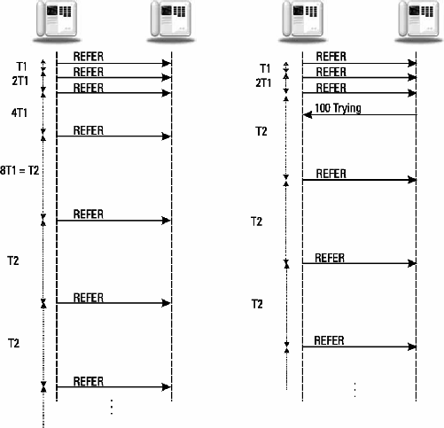

# 3	SIP Clients and Servers

The client-server nature of SIP has been introduced in the example message flows of Chapter 2. In this chapter, the types of clients and servers in a SIP network will be introduced and defined.

##	3.1	SIP User Agents

A SIP-enabled end device is called a SIP user agent (UA) [^1]. One purpose of SIP is to enable sessions to be established between user agents. As the name implies, a user agent takes direction or input from a user and acts as an agent on their behalf to set up and tear down media sessions with other user agents. In most cases the user will be a human, but the user could also be another protocol, as in the case of a gateway (described in Section 3.4). A UA must be capable of establishing a media session with another UA.

A UA must maintain the state on calls that it initiates or participates in. A minimum call state set includes the local and remote tags, Call-ID, local and remote CSeq header fields, along with the route set and any state information necessary for the media. This information is used to store the dialog information and for reliability. The remote CSeq storage is necessary to distinguish between a new request and a retransmission of an old request. A re-INVITE is used to change the session parameters of an existing or pending call. It uses the same Call-ID and tags as the original INVITE/200 OK exchange, but the CSeq is incremented because it is a new request. A retransmitted INVITE will contain the same Call-ID and CSeq as a previous INVITE. Even after a call has been terminated, the call state must be maintained by a user agent for at least 32 seconds in case of lost messages in the call tear down.

User agents silently discard an ACK for an unknown dialog. Requests to an unknown URI receive a 404 Not Found response. A user agent receiving a request for an unknown dialog responds with a 481 Dialog/Transaction Does Not Exist. Responses from an unknown dialog are also silently discarded. These silent discards are necessary for security. Otherwise, a malicious user agent could gain information about other SIP user agents by spamming fake requests or responses.

A minimal implementation must to be able to interpret any unknown response based on the class (first digit of the number) of the response, but it is not required to understand every response code defined. That is, if an undefined 498 Wrong Phase of the Moon response is received, it must be treated as a 400 Client Error.

A user agent responds to an unsupported request with a 501 Not Implemented response. For example, a UA receiving a method that it does not support would return a 501 response. A SIP UA must support UDP and TCP transport if it sends messages greater than 1,000 octets in size.

A SIP user agent contains both a client application and a server application. The two parts are a user agent client (UAC) and user agent server (UAS). The UAC initiates requests while the UAS generates responses. During a session, a user agent will usually operate as both a UAC and a UAS.

A SIP user agent must also support Session Description Protocol (SDP) for media description. Other types of media description protocols can be used in bodies, but SDP support is mandatory. Details of SDP are in Section 13.1.

A UA must understand any extensions listed in a Require header field in a request. Unknown header fields may be ignored by a UA. A UA should advertise its capabilities and features in any request it sends. This allows other UAs to learn them without having to make an explicit capabilities query. For example, the methods that a UA supports should be listed in an Allow header field. SIP extensions should be listed in a Supported header field. Message body types that are supported should be listed in an Accept header field.

UAs typically register with a proxy server in their domain.

## 3.2	Presence Agents

A presence agent (PA) [^2] is a SIP UA that is capable of receiving subscription requests and generating state notifications as defined by the SIP Events specification [^3]. An example of a presence agent can be found in Section 3.4. A presence agent supports the presence event package, responds to SUBSCRIBE requests, and sends NOTIFY requests. A presence agent also sometimes publishes event state to an event state compositor (ESC) using PUBLISH requests, as described in Section 4.1.9.

A presence agent can collect presence information from a number of devices. Presence information can come from a SIP device registering, a SIP device publishing presence information [^4], or many other non-SIP sources.

A presence server is also a presence UA that can supply presence information about a number of users and can also act as a proxy, forwarding SUBSCRIBE requests to another presence agents.

A presence agent first authenticates a subscription request. If the authentication passes, it establishes a dialog and sends the notifications over that dialog. The subscription can be refreshed by receiving new SUBSCRIBE requests.

Chapter 8 has a complete description of presence agents

## 3.3	Back-to-Back User Agents

A back-to-back user agent (B2BUA) is a type of SIP UA that receives a SIP request, then reformulates the request and sends it out as a new request. As such, some B2BUAs act like a proxy but do not follow proxy routing rules. For example, a B2BUA device can be used to implement an anonymizer service in which two SIP UAs can communicate without either party learning the other party’s URI, IP address, or other information. To achieve this, an anonymizer B2BUA would reformulate an incoming request with an entirely new From, Via, Contact, Call-ID, and SDP media information, also removing any other SIP header fields that might contain information about the calling party. The response returned would also change the Contact and SDP media information from the called party. The modified SDP would point to the B2BUA itself, which would forward RTP media packets from the called party to the calling party and vice versa. In this way, neither end point learns any identifying information about the other party during the session establishment. (Of course, the calling party needs to know the called party’s URI in order for the call to take place.)

Sometimes B2BUAs are employed to implement other SIP services. However, they break the end-to-end nature of an Internet protocol such as SIP. Also, a B2BUA is a call-stateful single point of failure in a network, which means their use will reduce the reliability of SIP sessions over the Internet. The relayed media suffers from increased latency and increased probability of packet loss, which can reduce the quality of the media session. Geographic distribution of B2BUAs can reduce these effects, but the problem of selecting the best B2BUA for a particular session is a very difficult one since the source and destination IP addresses of the media are not known until the session is actually established (with a 200 OK).

B2BUAs can be a part of many devices. For example, many private branch exchange (PBX) enterprise telephone systems incorporate B2BUA logic. Conference bridges and mixers also use B2BUA logic. Another type of B2BUA present in some SIP networks is application layer gateways (ALG). Some firewalls have ALG functionality built in, which allows a firewall to permit SIP and media traffic while still maintaining a high level of security. Another common type of B2BUA is known as a Session Border Controller (SBC). Some common functions of a SBC are listed in Table 3.1 [^5]. Note that many of these functions break the end-to-end security properties of SIP and SIP security.

| Topology Hiding              | Hiding all internal IP addresses to conceal internal topology |
| ---------------------------- | ------------------------------------------------------------ |
| Media Traffic Management     | Controlling which media types and codecs are used            |
| Fixing Capability Mismatches | Ensuring interop when multiple ways of implementing features happens (e.g., transfer with REFER or 3PCC) |
| Maintaining NAT Mappings     | Keeping SIP-related UDP NAT Mappings alive                   |
| Access Control               | Authenticating and challenging requests.                     |
| Protocol Repair              | Fixing known SIP interoperability failures in devices        |
| Media Encryption             | Allows SRTP in external network but RTP in internal network  |

## 3.4	SIP Gateways


In Figure 3.1, the SIP network, PSTN network, and H.323 networks are shown as clouds, which obscure the underlying details. Connecting to the SIP cloud are SIP IP telephones, SIP-enabled PCs, and corporate SIP gateways with attached telephones. The clouds are connected by gateways. H.323 terminals and H.323-enabled PCs are attached to the H.323 network. The PSTN cloud connects to ordinary analog black telephones (called because of the original color of their shell), digital ISDN telephones, and corporate private branch exchanges (PBXs). PBXs connect to the PSTN using shared trunks and provide line interfaces for either analog or digital telephones.

Gateways are sometimes decomposed into a media gateway (MG) and a media gateway controller (MGC). An MGC is sometimes called a call agent because it manages call control protocols (signaling), while the MG manages the media connection. This decomposition is transparent to SIP; the protocols used to decompose a gateway are described in Section 11.3.

Another difference between a user agent and a gateway is the number of users supported. While a user agent typically supports a single user (although perhaps with multiple lines), a gateway can support hundreds or thousands of users. A PSTN gateway could support a large corporate customer, or an entire geographic area. As a result, a gateway does not REGISTER every user it supports in the same way that a user agent might. Instead, a non-SIP protocol can be used to inform proxies about gateways and assist in routing. One protocol that has been proposed for this is Telephony Routing over IP (TRIP) [^7], which allows an interdomain routing table of gateways to be developed. In addition, there is an extension to the REGISTER method that allows a gateway to register multiple phone numbers [8] with a registrar server within a domain.

## 3.5	SIP Servers

SIP servers are applications that accept SIP requests and respond to them. A SIP server should not be confused with a user agent server or the client-server nature of the protocol, which describe operation in terms of clients (originators of requests) and servers (originators of responses to requests). A SIP server is a different type of entity; the types of SIP servers discussed in this section are logical entities. Actual SIP server implementations may contain a number of server types or may operate as a different type of server under different conditions. Because servers provide services and features to user agents, they must support both TCP and UDP for transport. Figure 3.2 shows the interaction of user agents, servers, and a location service. Note that the protocol used between a server and the location service or database is generally not SIP and is not discussed in this book.


###	3.5.1	Proxy Servers

A SIP proxy server receives a SIP request from a user agent or another proxy and acts on behalf of the user agent in forwarding or responding to the request. Just as a router forwards IP packets at the IP layer, a SIP proxy forwards SIP messages at the application layer. A proxy is not a B2BUA since it is only allowed to modify requests and responses according to strict rules set out in RFC 3261. These rules preserve the end-to-end transparency of the SIP signaling while still allowing a proxy server to perform valuable services and functions for user agents.

A proxy server typically has access to a database or a location service to aid it in processing the request (determining the next hop). The interface between the proxy and the location service is not defined by the SIP protocol. A proxy can use any number of types of databases to aid in processing a request. Databases could contain SIP registrations, presence information, or any other type of information about where a user is located. The example in Figure 2.2 introduced a proxy server as a facilitator of SIP message exchange, providing user location services to the caller.

A proxy does not need to understand a SIP request in order to forward it—any unknown request type is assumed to use the non-INVITE transaction model. A proxy should not change the order of header fields or in general modify or delete header fields.

A proxy server is different from a user agent or gateway in three key ways:

1. A proxy server does not issue requests; it only responds to requests from a user agent. (CANCEL and ACK requests are an exception to this rule.)

2. A proxy server has no media capabilities.

3. A proxy server does not parse message bodies; it relies exclusively on SIP header fields.

Figure 3.3 shows a common network topology known as the SIP Trapezoid. 


In this topology, a pair of user agents in different domains establishes a session using a pair of proxy servers, one in each domain. The trapezoid refers to the shape formed by the signaling and media messages. In this configuration, each user agent is configured with a default outbound proxy server, to which it sends all requests. This proxy server typically will authenticate the user agent and may pull up a profile of the user and apply outbound routing services. In an interdomain exchange, DNS SRV queries will be used to locate a proxy server in the other domain. This proxy, sometimes called an inbound proxy, may apply inbound routing services on behalf of the called party. This proxy also has access to the current registration information for the user, and can route the request to the called party. In general, future SIP requests will be sent directly between the two user agents, unless one or both proxies insert a Record-Route header field.

A proxy server can be either stateless or stateful. A stateless proxy server processes each SIP request or response based solely on the message contents. Once the message has been parsed, processed, and forwarded or responded to, no information (such as dialog information) about the message is stored. A stateless proxy never retransmits a message, and does not use any SIP timers. Note that the stateless loop detection using Via header fields described in RFC 2543 has been deprecated (removed) in RFC 3261 in favor of the use of a mandatory Max-Forwards header field in all requests.

A stateful proxy server keeps track of requests and responses received in the past and uses that information in processing future requests and responses. For example, a stateful proxy server starts a timer when a request is forwarded. If no response to the request is received within the timer period, the proxy will retransmit the request, relieving the user agent of this task. Also, a stateful proxy can require user agent authentication, as described in Chapter 15.

The most common type of SIP proxy is a transaction stateful proxy. A transaction stateful proxy keeps state about a transaction but only for the duration of the pending request. For example, a transaction stateful proxy will keep state when it receives an INVITE request until it receives a 200 OK or a final failure response (e.g., 404 Not Found). After that, it would destroy the state information. This allows a proxy to perform useful search services but minimize the amount of state storage required.

One such example of a search service is a proxy server that receives an INVITE request, then forwards it to a number of locations at the same time, or forks the request. This forking proxy server keeps track of each of the outstanding requests and the response to each, as shown in Figure 3.4. This is useful if the location service or database lookup returns multiple possible locations for the called party that need to be tried.


In the example of Figure 3.4, the INVITE contains:

```ini
INVITE sip:support@chaos.example.org SIP/2.0
Via: SIP/2.0/UDP 45.2.32.1:5060 ;branch=z9hG4bK67865
Max-Forwards: 70
To: <sip:support@chaos.example.org>
From: A. N. Sarkovskii <sip:sarkovskii@45.2.32.1>;tag=7643545
Call-ID: 0140092501
CSeq: 1 INVITE
Subject: Bifurcation Question
Contact: <sip:sarkovskii@45.2.32.1>
Content-Type: application/sdp
Content-Length: ...

(SDP not shown)
```

The INVITE is received by the chaos.info proxy server, which forks to two user agents. Each user agent begins alerting, sending two provisional responses back to Sarkovskii. They are:

```ini
SIP/2.0 180 Ringing

Via: SIP/2.0/UDP 45.2.32.1:5060;branch=z9hG4bK67865
To: <sip:support@chaos.example.org>;tag=343214112
From: A. N. Sarkovskii <sip:sarkovskii@45.2.32.1>;tag=7643545
Call-ID: 0140092501
CSeq: 1 INVITE
Contact: <sip:agent42@67.42.2.1>
Content-Length: 0
```

and: 

```ini
SIP/2.0 180 Ringing
Via: SIP/2.0/UDP 45.2.32.1:5060;branch=z9hG4bK67865
To: <sip:support@chaos.example.org>;tag=a5ff34d9ee201
From: A. N. Sarkovskii <sip:sarkovskii@45.2.32.1>;tag=7643545
Call-ID: 0140092501
CSeq: 1 INVITE Contact: <sip:agent7@67.42.2.32>
Content-Length: 0
```

The two responses are identical except for having different To tags and Contact URIs. Finally, one of the two UAs answers and sends a 200 OK response:

```ini
SIP/2.0 200 OK
Via: SIP/2.0/UDP 45.2.32.1:5060;branch=z9hG4bK67865
To: <sip:support@chaos.example.org>;tag=343214112
From: A. N. Sarkovskii <sip:sarkovskii@45.2.32.1>;tag=7643545
Call-ID: 0140092501
CSeq: 1 INVITE Contact: <sip:agent42@67.42.2.1>
Content-Type: application/sdp
Content-Length: ...

(SDP not shown)
```

The forking proxy server sends a CANCEL to the second UA to stop that phone alerting. If both UAs had answered, the forking proxy would have forwarded both 200 OK responses back to the caller who then would have had to choose which one, most likely by accepting one and sending a BYE to the other.

A stateful proxy usually sends a 100 Trying response when it receives an INVITE. A stateless proxy never sends a 100 Trying response. A 100 Trying response received by a proxy is never forwarded—it is a single hop only response. A proxy handling a TCP request must be stateful, since a user agent will assume reliable transport and rely on the proxy for retransmissions on any UDP hops in the signaling path(TCP usually provides end-to-end reliability for applications. In SIP, however, TCP only provides single-hop reliability. End-to-end reliability is only achieved by a chain of TCP hops or TCP hops interleaved with UDP hops and stateful proxies.).

The only limit to the number of proxies that can forward a message is controlled by the Max-Forwards header field, which is decremented by each proxy that touches the request. If the Max-Forwards count goes to zero, the proxy discards the message and sends a 483 Too Many Hops response back to the originator.

The SIP session timer extension [^9] limits the time period over which a stateful proxy must maintain state information without a refresh re-INVITE. In the initial INVITE request, a Session-Expires header field indicates a timer interval after which stateful proxies may discard state information about the session. User agents must tear down the call after the expiration of the timer. The caller can send re-INVITEs to refresh the timer, enabling a “keep alive” mechanism for SIP. This solves the problem of how long to store state information in cases where a BYE request is lost or misdirected or in other security cases described in later sections. The details of this implementation are described in Section 6.2.35.

### 3.5.2	Redirect Servers

A redirect server was introduced in Figure 2.6 as a type of SIP server that responds to, but does not forward, requests. Like a proxy server, a redirect server uses a database or location service to look up a user. However, the location information is sent back to the caller in a redirection class response (3xx), which, after the ACK, concludes the transaction. Figure 3.5 shows a call flow that is very similar to the example in Figure 3.2, except the server uses redirection instead of proxying to assist Schrodinger in locating Heisenberg.

The INVITE from Figure 3.5 contains:

```ini
INVITE sip:werner.heisenberg@munich.de.example.org SIP/2.0
Via: SIP/2.0/UDP 100.101.102.103:5060 ;branch=z9hG4bK54532
Max-Forwards: 70
To: Heisenberg <sip:werner.heisenberg@munich.de.example.org>
From: E. Schrodinger <sip:schroed5244@wave.example.org>;tag=4313413
Call-ID: 734224912341371927319032
CSeq: 1 INVITE
Subject: Where are you exactly?
Contact: <sip:schroed5244@pc33.wave.example.org>
Content-Type: application/sdp
Content-Length: 150

v=0
o=schroed5244 2890844526 2890844526 IN IP4 100.101.102.103
s=
t=0 0
c=IN IP4 100.101.102.103
m=audio 49172 RTP/AVP 0
a=rtpmap:0 PCMU/8000
```


The redirection response to the INVITE is sent by the redirect server:

```ini
SIP/2.0 302 Moved Temporarily
Via: SIP/2.0/UDP 100.101.102.103:5060;branch=z9hG4bK54532
To: Heisenberg <sip:werner.heisenberg@munich.de.example.org>;tag=052500
From: E. Schrodinger <sip:schroed5244@wave.example.org>;tag=4313413
Call-ID: 734224912341371927319032
CSeq: 1 INVITE
Contact: sip:werner.heisenberg@200.201.202.203
Content-Length: 0
```

Schrodinger acknowledges the response:

```ini
ACK sip:werner.heisenberg@munich.de.example.org SIP/2.0
Via: SIP/2.0/UDP 100.101.102.103:5060;branch=z9hG4bK54532
Max-Forwards: 70
To: Heisenberg <sip:werner.heisenberg@munich.de.example.org>;tag=052500
From: E. Schrodinger <sip:schroed5244@wave.example.org>;tag=4313413
Call-ID: 734224912341371927319032
CSeq: 1 ACK
Content-Length: 0
```

Notice that the ACK request reuses the same branch ID as the INVITE and the 302 response. This is because an ACK to a non-2xx final response is considered to be part of the same transaction as the INVITE. Only an ACK sent in response to a 200 OK is considered a separate transaction with a unique branch ID. Also, an ACK to a non-2xx final response is a hop-by-hop response, not an end-to-end response as discussed in Section 3.6.

This exchange completes this call attempt, so a new INVITE is generated with a new Call-ID and sent directly to the location obtained from the Contact header field in the 302 response from the redirect server.

```ini
INVITE sip:werner.heisenberg@200.201.202.203 SIP/2.0
Via: SIP/2.0/UDP 100.101.102.103:5060;branch=z9hG4bK92313
Max-Forwards: 70
To: Heisenberg <sip:werner.heisenberg@munich.de.example.org>
From: E. Schrodinger <sip:schroed5244@wave.example.org>;tag=13473
Call-ID: 54-67-45-23-13
CSeq: 1 INVITE Subject: Where are you exactly?
Contact: <sip:schroed5244@pc33.wave.example.org>
Content-Type: application/sdp 
Content-Length: 150

v=0
o=schroed5244 2890844526 2890844526 IN IP4 100.101.102.103
s=
t=0 0
c=IN IP4 100.101.102.103
m=audio 49172 RTP/AVP 0
a=rtpmap:0 PCMU/8000
```

The call then proceeds in the same way as Figure 3.2, with the messages being identical. Note that in Figure 3.5, a 180 Ringing response is not sent; instead, the 200 OK response is sent right away. Since 1xx informational responses are optional, this is a perfectly valid response by the UAS if Heisenberg responded to the alerting immediately and accepted the call. In the PSTN, this scenario is called fast answer.

### 3.5.3	Register Servers

A SIP registrar server was introduced in the example of Figure 3.3. A registrar server, also known as a registration server, accepts SIP REGISTER requests; all other requests receive a 501 Not Implemented response. The contact information from the request is then made available to other SIP servers within the same administrative domain, such as proxies and redirect servers. In a registration request, the To header field contains the name of the resource being registered, and the Contact header fields contain the contact or device URIs. The registration server creates a temporary binding between the address of record (AOR) URI in the To and the device URI in the Contact header field.

Registration servers usually require the registering user agent to be authenticated, using the means described in Chapter 15, so that incoming calls cannot be hijacked by an unauthorized user. This could be accomplished by an unauthorized user registering someone else’s SIP URI to point to his or her own UA. Incoming calls to that URI would then ring the wrong UA. Depending on the header fields present, a REGISTER request can be used by a user agent to retrieve a list of current registrations, clear all registrations, or add a registration URI to the list. These types of requests are described in Section 4.1.2.

There are a number of ways in which a proxy may know to fork a request to a set of UAs. One way is through manual configuration, such as entering the information in a Web page or database. Another way is to have multiple registrations for the same AOR. If multiple UAs register against the same AOR, the proxy can fork an incoming request to all of them. The priority of multiple registrations is governed by the q-value included in the Contact header field. For contacts of the same priority, a proxy can fork the request to all of them at the same time. For contacts with different priorities, a proxy can do sequential forking, sending the request in the order specified by the q-values.

For full registration security, TLS must be used as HTTP digest does not provide the needed integrity protection. Otherwise, an attacker can modify the Contact URI in an authenticated REGISTER to point to another UA.

## 3.6	Uniform Resource Indicators

SIP uses a number of Uniform Resource Identifiers. Common URIs are shown in Table 3.2.

SIP URIs will be discussed in Section 4.2. SIPS will be covered in Chapter 15. Telephony URI is covered in Section 4.2.2. Presence and IM URIs are covered in Chapter 8, along with the XMPP URI. H.323 URIs are covered in Section 11.4. Web URIs are defined in [10].

SIP uses Uniform Resource Indicators or URIs for most addresses. URIs and URLs were introduced in Section 1.4. For SIP, the URI scheme is either sip for a normal SIP URI or sips for a Secure SIP URI. Secure SIP means that a SIP message sent using this URI will be protected using TLS across each hop. SIP URIs must contain either a host name or an IP address. They usually contain a user part, although they do not have to. For example, a URI for a proxy server typically will not have a user part. URIs also may contain parameters. SIP URI parameters are listed in Table 3.3. In this table, URI means any valid URI while URN means any valid URN.

​                                      **Table 3.2	Common URIs Used with SIP**

| URI   | Use               | Specification |
| ----- | ----------------- | ------------- |
| sip   | SIP               | RFC 326       |
| sips  | Secure SIP        | RFC 3261      |
| tel   | Telephony         | RFC 3966      |
| pres  | Presence          | RFC 3861      |
| im    | Instant Messaging | RFC 3861      |
| xmpp  | XMPP(Jabber)      | RFC 4622      |
| h323  | H.323             | RFC 3508      |
| http  | Web               | RFC 7540      |
| https | Secure Web        | RFC 2818      |

​								**Table 3.3	SIP URI Parameters**


The following is a list of some examples of SIP URIs.

```ini
sip:fred@flintstone.example.org
sip:vilma@flintstone.example.org;transport=tcp
sip:the%20great%one@whalers.example.org
sip:7325551212@gw.gateway.com.example.org
sip:192.0.3.4:44352
sip:proxy34.sipstation.com.example.com
sip:r3.example.com;lr
sip:+43321232;user=phone@sp.serviceprovider.example.org
```

SIP URIs can also be used to encoded telephone numbers. Sometimes, this includes the user=phone parameter.

## 3.7	Acknowledgment of Messages

Most SIP requests are end-to-end messages between user agents. Proxies between the two user agents simply forward the messages they receive and rely on the user agents to generate acknowledgments or responses.

There are some exceptions to this general rule. The CANCEL method (used to terminate pending calls or searches and discussed in detail in Section 4.1.5) is a hop-by-hop request. A proxy receiving a CANCEL immediately sends a 200 OK response back to the sender and generates a new CANCEL, which is then forwarded in the next hop to the same set of destinations as the original request. (The order of sending the 200 OK and forwarding the CANCEL is not important.) This is shown in Figure 3.4.

Other exceptions to this rule include 3xx, 4xx, 5xx, and 6xx responses to an INVITE request. While an ACK to a 2xx response is generated by the end point, a 3xx, 4xx, 5xx, or 6xx response is acknowledged on a hop-by-hop basis. A proxy server receiving one of these responses immediately generates an ACK back to the sender and forwards the response to the next hop. This type of hop-by-hop acknowledgment is shown in Figure 4.2.

ACK messages are only sent to acknowledge responses to INVITE requests. For responses to all other request types, there is no acknowledgment. A lost response is detected by the UAS when the request is retransmitted.

## 3.8	Reliability

SIP has reliability mechanisms defined, which allow the use of unreliable transport layer protocols such as UDP. When SIP uses TCP, these mechanisms are not used, since it is assumed that TCP will retransmit the message if it is lost and inform the client if the server is unreachable.

For SIP transport using UDP, there is always the possibility of messages being lost or even received out of sequence, because UDP guarantees only that the datagram is error free. A UAS validates and parses a SIP request to make sure that the UAC has not errored by creating a request missing required header fields or other syntax violations. Reliability mechanisms in SIP include:

- Retransmission timers;

- Increasing command sequence CSeq numbers;

- Positive acknowledgments.

How SIP handles retransmissions depends on the method. One retransmission scheme is defined for INVITEs, known as INVITE transactions, and another is defined for all other methods, known as a non-INVITE transaction.

For non-INVITE transactions, a SIP timer, T1, is started by a UAC or a stateful proxy server when a new request is generated or sent. If no response to the request (as identified by a response containing the identical local tag, remote tag, Call-ID, and CSeq) is received when T1 expires, the request is resent. After a request is retransmitted, the next timer period is doubled until T2 is reached. If a provisional (informational class 1xx) response is received, the UAC or stateful proxy server immediately switches to timer T2. After that, the remaining retransmissions occur at T2 intervals. This capped exponential backoff process is continued until a 64*T1, after which the request is declared dead. A stateful proxy server that receives a retransmission of a request discards the retransmission and continues its retransmission schedule based on its own timers. Typically, it will resend the last provisional response. This retransmission scheme for non-INVITE is shown in Figure 3.6 for a REFER request.

For an INVITE transaction, the retransmission scheme is slightly different. INVITEs are retransmitted starting at T1, and then the timer is doubled after each retransmission. The INVITE is retransmitted until 64*T1 after which the request is declared dead. After a provisional (1xx) response is received, the INVITE is never retransmitted. This retransmission scheme is shown in Figure 3.7. A proxy may discard the transaction state after 3 minutes. A stateful proxy must store a forwarded request or generated response message for 32 seconds. Suggested default values for T1 and T2 are 500 ms and 4 seconds, respectively. Timer T1 is supposed to be an estimate of the roundtrip time (RTT) in the network. Longer values are allowed, but not shorter ones, because this will generate more message retransmissions. See Table 4 in RFC 3261 [1] for a summary of SIP timers.



Note that gaps in CSeq number do not always indicate a lost message. In the authentication examples, not every request (and hence CSeq) generated by the UAC will reach the UAS if authentication challenges occur by proxies in the path.

## 3.9	Multicast Support

SIP support for UDP multicast has been mentioned in previous sections. There are two main uses for multicast in SIP.

SIP registration can be done using multicast, by sending the REGISTER message to the well-known “All SIP Servers” URI sip:sip.mcast.net at IP address 224.0.1.75 for IPv4. The ttl parameter is usually set to 1 to indicate that only a single hop should be used.


RFC 2543 defined sending other SIP messages, including INVITE, over multicast. However, this was not included in RFC 3261 and is no longer considered standard SIP.

The use of a multicast address is indicated by the maddr parameter in a URI or in a SIP message using the maddr parameter in the Via header field.

## 3. 10	Conclusion

This chapter introduced SIP clients and servers, discussing user agents, gateways, proxies, redirect servers, and registrars. SIP URIs, reliability, and retransmissions were also covered.

## 3.11	Questions

Q3.1 Fill in the missing messages in the call flow below with two UAs and one proxy (see Figure 3.8).


Q3.2 A User Agent sends an OPTIONS to another User Agent which does not respond. Assume T1 = 500 ms and T2 = 4 seconds. Show the timing of the retransmissions relative to t=0 when the first OPTIONS is sent. How many messages are sent all together?

Q3.3 Fill in the CSeq header fields (number AND method) for each of the messages in Figure 3.9.


Q3.4 Add the missing SIP messages and responses for the call flow in Figure 3.10. Assume the proxy does not Record-Route (Hint: There are six missing messages that will result in just a single media session between Alice and Bob.)


Q3.5 Fill in the time intervals for the retransmission example in Figure 3.11.


Q3.6 What are two ways that a proxy knows to fork a request?

Q3.7 When does a proxy generate an ACK to a response, and when does it just forward the response without generating an ACK?

Q3.8 What is the difference between a redirect server and a proxy server?

Q3.9 What is the purpose of a SIP registrar server?

Q3.10 A UA sends a REGISTER. After 2.3 seconds, a 100 Trying response is received. After another 0.7 second, a 200 OK response is received. In total, how many times was the REGISTER request sent?

## References

[^1]:	Rosenberg, J., et al., “SIP: Session Initiation Protocol,” RFC 3261, June 2002.
[^2]:	Rosenberg, J., “A Presence Event Package for the Session Initiation Protocol (SIP),” RFC 3856, August 2004.
[^3]:	Roach, A., “SIP—Specific Event Notification,” RFC 6665, July 2012.
[^4]:	Niemi, A., “Session Initiation Protocol (SIP) Extension for Event State Publication,” RFC 3903, October 2004.
[^5]:	Hautakorpi, J., et al., “Requirements from SIP (Session Initiation Protocol) Session Border Control Deployments,” RFC 5853, April 2010.
[^6]:	Schulzrinne, H., and C. Agboh, “Session Initiation Protocol (SIP)-H.323 Interworking Requirements,” RFC 4123, July 2005.
[^7]:	Rosenberg, J., H. Salama, and M. Squire, “Telephony Routing over IP (TRIP),” RFC 3219, January 2002.
[^8]:	Roach, A., “Registration for Multiple Phone Numbers in the Session Initiation Protocol (SIP),” RFC 6140, March 2011.
[^9]:	Donovan, S., and J. Rosenberg, “Session Timers in the Session Initiation Protocol (SIP),” RFC 4028, April 2005.
[^10]: 	Belshe, M., et al., “Hypertext Transfer Protocol Version 2 (HTTP/2),” RFC 7540, May 2015.
[^11]: 	Burger, E., J. Van Dyke, and A. Spitzer, “Basic Network Media Services with SIP,” RFC 4240, December 2005.
[^12]: 	Bormann, C., et al., “Applying Signaling Compression (SigComp) to the Session Initiation Protocol (SIP),” RFC 5049, December 2007.
[^13]: 	Jennings, C., F. Audet, and J. Elwell, “Session Initiation Protocol (SIP) URIs for Applications such as Voicemail and Interactive Voice Response (IVR),” RFC 4458, April 2006.
[^14]: 	Rosenberg, J., “Obtaining and Using Globally Routable User Agent URIs (GRUUs) in the Session Initiation Protocol (SIP),” RFC 5627, October 2009.
[^15]: 	Jennings, C., Mahy, R., and F. Audet, “Managing Client-Initiated Connections in the Session Initiation Protocol (SIP),” RFC 5626, October 2009.

