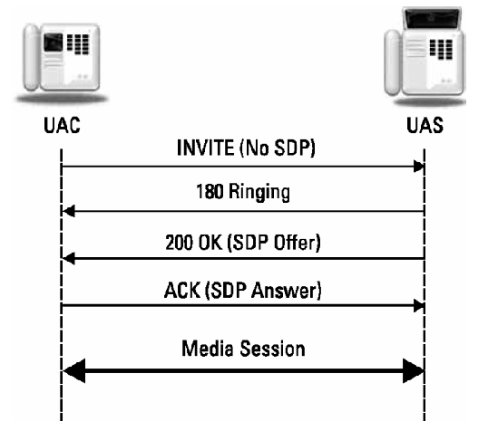

# 4	SPI Request Messages

This chapter covers the types of SIP requests called methods. Six are described in the SIP specification document RFC 3261 [1]. Eight more methods are described in separate RFC documents. After discussing the methods, this chapter concludes with a discussion of SIP URLs and URIs, tags, and message bodies.

## 4.1 Methods

SIP requests or methods are considered “verbs” in the protocol, since they request a specific action to be taken by another user agent or server. The INVITE, REGISTER, BYE, ACK, CANCEL, and OPTIONS methods are the original six methods in SIP. The REFER, SUBSCRIBE, NOTIFY, PUBLISH, MESSAGE, UPDATE, INFO, and PRACK methods are described in separate RFCs.

A user agent (UA) receiving a method it does not support replies with a 501 Not Implemented response. Method names are case-sensitive and conventionally use all uppercase for visual clarity to distinguish them from header fields, which use both uppercase and lowercase. Note that a proxy does not need to understand a request method in order to forward the request. A proxy treats an unknown method as if it were an OPTIONS; that is, it forwards the request to the destination if it can. This allows new features and methods useful for user agents to be introduced without requiring support from proxies that may be in the middle. UAs should indicate which methods they support in an Allow header field in requests and responses.

## 4.1.1	INVITE

The INVITE method is used to establish media sessions between user agents. In telephony, it is similar to a Setup message in ISDN or an initial address message (IAM) in ISUP. (PSTN protocols are briefly introduced in Section 11.1.) Responses to INVITEs are always acknowledged with the ACK method described in Section 4.1.4. Examples of the use of the INVITE method are described in Chapter 2.

An INVITE usually has a message body containing the media information of the caller. The message body can also contain other session information, such as a resource list. If an INVITE does not contain media information, the ACK contains the media information of the UAC. An example of this call flow is shown in Figure 4.1.

 

If the media information contained in the ACK is not acceptable, then the called party must send a BYE to cancel the session—a CANCEL cannot be sent because the session is already established. A media session is considered established when the INVITE, 200 OK, and ACK messages have been exchanged between the UAC and the UAS. A successful INVITE request establishes a dialog between the two user agents, which continues until a BYE is sent by either party to end the session, as described in Section 4.1.3.

A UAC that originates an INVITE to establish a dialog creates a globally unique Call-ID that is used for the duration of the call. A CSeq count is initialized (which need not be set to 1, but must be an integer) and incremented for each new request for the same Call-ID. The To and From headers are populated with the remote and local addresses. A From tag is included in the INVITE, and the UAS includes a To tag in any responses, as described in Section 4.3. A To tag in a 200 OK response to an INVITE is used in the To header field of the ACK and all future requests within the dialog. **The combination of the To tag, From tag, and Call-ID is the unique identifier for the dialog.**

An INVITE sent for an existing dialog references the same Call-ID as the original INVITE and contains the same To and From tags. Sometimes called a re-INVITE, the request is used to **change the session characteristics or refresh the state of the dialog**. The CSeq command sequence number is incremented so that a UAS can distinguish the re-INVITE from a retransmission of the original INVITE.

If a re-INVITE is refused or fails in any way, the session continues as if the INVITE had never been sent. A re-INVITE must not be sent by a UAC until a final response to the initial INVITE has been received—instead, an UPDATE request can be sent, as described in Section 4.1.14. There is an additional case where two UAs simultaneously send re-INVITEs to each other. This is handled in the same way with a Retry-After header. This condition is called glare in telephony (see Figure 5.3) and occurs when both ends of a trunk group seize the same trunk at the same time.

An **Expires header** in an INVITE indicates to the UAS how long the call request is valid. For example, the UAS could leave an unanswered INVITE request displayed on a screen for the duration specified in the Expires header. Once a session is established, the Expires header has no meaning—the expiration of the time does not terminate the media session. Instead, a **Session-Expires header** can be used to place a time limit on an established session without a re-INVITE or UPDATE refresh.

An example INVITE request with a SDP message body is shown here:

```ini
NVITE sip:411@salzburg.example.org;user=phone SIP/2.0
Via: SIP/2.0/UDP salzburg.example.org:5060;branch=z9hG4bK1d32hr4
Max-Forwards:70
To: <sip:411@salzburg.at;user=phone>
From: Christian Doppler <sip:c.doppler@salzburg.example.org> ;tag=817234
Call-ID: 12-45-A5-46-F5-43-32-F3-C2
CSeq: 1 INVITE
Subject: Train Timetables
Allow: INVITE, ACK, CANCEL, BYE, OPTIONS, REFER, SUBSCRIBE, NOTIFY
Contact: sip:c.doppler@salzburg.example.org
Content-Type: application/sdp
Content-Length: ...

v=0
o=doppler 2890842326 2890844532 IN IP4 salzburg.example.org
s=
c=IN IP4 50.61.72.83
t=0 0 m=audio 49172 RTP/AVP 97 98 0
a=rtpmap:97 iLBC/8000
a=rtpmap:98 SPEEX/8000
a=rtpmap:0 PCMU/8000
```

In addition to the required headers, this request contains the optional Subject and Allow header fields. Note that this Request-URI contains a phone number. Phone number support in SIP URIs is described in Section 4.2.

The mandatory and header fields in an INVITE request are shown in Table 4.1.


## References

[^1]: Rosenberg, J., et al., “SIP: Session Initiation Protocol,” RFC 3261, June 2002.
[^2]: Rosenberg, J., “Obtaining and Using Globally Routable User Agent (UA) URIs (GRUU) in the Session Initiation Protocol (SIP),” RFC 5726, October 2009.
[^3]: Rosenberg, J., H. Schulzrinne, and P. Kyzivat, “Indicating User Agent Capabilities in the-Session Initiation Protocol (SIP),” RFC 3840, August 2004.
[^4]: Johnston, A., and O. Levin, “Session Initiation Protocol (SIP) Call Control—Conferencing for User Agents,” BCP 119, RFC 4579, August 2006.
[^5]: Roach, A., “SIP-Specific Event Notification,” RFC 6665, July 2012.
[^6]: Petrack, S., and L. Conroy, “The PINT Service Protocol: Extensions to SIP and SDP for IP Access to Telephone Call Services,” RFC 2848, June 2000.
[^7]: Rosenberg, J., “A Watcher Information Event Template-Package for the Session Initiation Protocol (SIP),” RFC 3857, August 2004.
[^8]: Worley, D., et al., “Completion of Calls for the Session Initiation Protocol (SIP),” RFC 6910, April 2013.
[^9]: Jennings, C., and J. Fischl, “Certificate Management Service for the Session Initiation Protocol (SIP),” RFC 6072, February 2011.
[^10]: Rosenberg, J., H. Schulzrinne, and O. Levin, “A Session Initiation Protocol (SIP) Event Package for Conference State,” RFC 4575, August 2006.
[^11]: Camarillo, G., “The Session Initiation Protocol (SIP) Pending Additions Event Package,” RFC 5362, October 2008.
[^12]: Rosenberg, J., H. Schulzrinne, and R. Mahy, “An INVITE-Initiated Dialog Event Package-for the Session Initiation Protocol (SIP),” RFC 4235, November 2005.
[^13]: Roach, A., “A SIP Event Package for Subscribing to Changes to an HTTP Resource,” RFC 5989, October 2010.
[^14]: Burger, E., and M. Dolly, “A Session Initiation Protocol (SIP) Event Package for Key Press Stimulus (KPML),” RFC 4730, November 2006.
[^15]: Shen, C., H. Schulzrinne, and A. Koike, “A Session Initiation Protocol (SIP) Load-Control Event Package,” RFC 7200, April 2014.
[^16]: Mahy, R., “A Message Summary and Message Waiting Indication Event Package for the Session Initiation Protocol (SIP),” RFC 3842, August 2004.
[^17]: Garcia-Martin, M., “A Session Initiation Protocol (SIP) Event Package and Data Format for Various Settings in Support for the Push-to-Talk over Cellular (PoC) Service,” RFC 4354, January 2006.
[^18]: Rosenberg, J., “A Presence Event Package for the Session Initiation Protocol (SIP),” RFC 3856, August 2004.
[^19]: Rosenberg, J., “A Session Initiation Protocol (SIP) Event Package for Registrations,” RFC 3680, March 2004.
[^20]: Sparks, R., “The Session Initiation Protocol (SIP) Refer Method,” RFC 3515, April 2003.
[^21]: Hilt, V., and G. Camarillo, “A Session Initiation Protocol (SIP) Event Package for Session-Specific Policies,” RFC 6795, December 2012.
[^22]: Ciavattone, L., et al., “Test Plan and Results Supporting Advancement of RFC 2679 on the Standards Track,” RFC 6808, December 2012.
[^23]: Pendleton A., et al., “Session Initiation Protocol Event Package for Voice Quality Reporting,” RFC 6035, November 2010.
[^24]: Urpalainen, J., and D. Willis, “An Extensible Markup Language (XML) Configuration Access Protocol (XCAP) Diff Event Package,” RFC 5875, May 2010.
[^25]: Niemi, A., “Session Initiation Protocol (SIP) Extension for Event State Publication,” RFC 3903, October 2004.
[^26]: Fielding, R., et al., “Hypertext Transfer Protocol—HTTP/1.1,” RFC 2616, June 1999.
[^27]: Sparks, R., “Internet Media Type message/sipfrag,” RFC 3420, November 2002.
[^28]: Levin, O., “Suppression of Session Initiation Protocol (SIP) REFER Method Implicit Subscription,” RFC 4488, May 2006.
[^29]: Sparks, R., “Explicit Subscriptions for the REFER Method,” draft-ietf-sipcore-refer-explicit-subscription-00 (work in progress) November 2014.
[^30]: Sparks, R., and A. Johnston, “Session Initiation Protocol Call Control—Transfer,” RFC 5589, June 2009.
[^31]: Levin, O., and A. Johnston, “Conveying Feature Tags with the Session Initiation Protocol (SIP) REFER Method,” RFC 4508, May 2006.
[^32]: Campbell, B., et al., “Session Initiation Protocol (SIP) Extension for Instant Messaging,” RFC 3428, December 2002.
[^33]: Klyne, G., and D. Atkins, “Common Presence and Instant Messaging (CPIM): Message Format,” RFC 3862, August 2004.
[^34]: Peterson, J., “Address Resolution for Instant Messaging and Presence,” RFC 3861, August 2004.
[^35]: Holmberg, C. et al., “The SIP INFO Method,” RFC 6086, January 2011.
[^36]: Rosenberg, J., and H. Schulzrinne, “Reliability of Provisional Responses in Session Initiation Protocol (SIP),” RFC 3262, June 2002.
[^37]: Rosenberg, J., “The Session Initiation Protocol (SIP) UPDATE Method,” RFC 3311, September 2002.
[^38]: Hoffman, P., L. Masinter, and J. Zawinski, “The mailto URL Scheme,” RFC 2368, July 1998.
[^39]: Rosen, B., “Dial String Parameter for the Session Initiation Protocol Uniform Resource Identifier,” RFC 4967, July 2007.
[^40]: Schulzrinne, H., “The tel URI for Telephone Numbers,” RFC 3966, December 2004.
[^41]: Camarillo, G., “Message Body Handling in the Session Initiation Protocol (SIP),” RFC 5621, September 2009.

