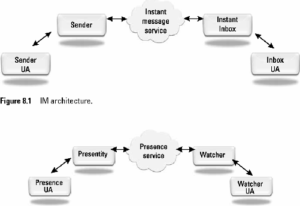
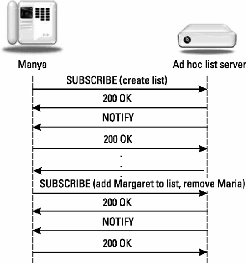

# 8	Presence and Instant Messaging

## 8.1	Introduction

This chapter will cover presence and instant messaging (IM) with SIP. First the history of IM and presence will be covered. Then the SIP events framework will be explored, showing how presence was added to SIP. The set of protocols known as SIMPLE or SIP for Instant Messaging and Presence Leveraging Extensions will be covered. The two different modes of IM will be covered: page mode and session mode using the Message Session Relay Protocol (MSRP). The Jabber presence and instant messaging protocol, also known as the Extensible Messaging and Presence Protocol (XMPP) will also be introduced. Ongoing work to interwork and map presence and instant messages between XMPP and SIMPLE will also be covered.

## 8.2	History of IM and Presence

Presence is the ability to sense the willingness of another user to communicate. Instant messaging (IM) is a way of exchanging short text messages in near-real time. Presence is often used to determine when another user is available in order to start an instant message exchange. Instant messages are usually sent when the user hits the enter key or when the user clicks a send button. Often, messages are grouped together in a window and shown in sequential order, turning it into a conversation.

A very early presence tool over TCP/IP was the Unix finger command. Finger allowed a user to look up information about another user, which often included information about the last time the user logged in and the last time mail was read. A very early IM client used on the Internet was known as ICQ (pronounced like “I seek you”) [1]. The first version was released in 1996. It provided basic instant messaging between users. America Online’s AOL Instant Messenger (AIM) was the first widely used instant messaging and presence application [2]. It was released in 1997 and quickly became popular. It introduced the concept of a “buddy list” or a contact list of other users, which is displayed in a small window. Note that this contact list is stored in the network, allowing the user to have access to the contact list regardless of which computer or device from which they log in. This user interface is common to nearly all IM systems today. Many other IM clients and systems have been developed, and nearly all are proprietary closed systems. This has resulted in the development of multi-headed clients that present a common user interface and contact list to the user, but log the user into a number of separate systems on the back end.

To address IM and interoperability, the IETF standardized two IM and presence protocols. One was a set of SIP extensions known as SIMPLE (SIP for Instant Messaging Leveraging Extensions). The other was XMPP (Extensible Messaging and Presence Protocol), which is based on the Jabber open source client. SIMPLE is covered in Section 8.3.4, while XMPP/Jabber is described in Section 8.6. Today, both SIMPLE and XMPP are used to interconnect various closed IM systems. The instant messaging architecture is shown in Figure 8.1 and its elements are in Tables 8.1 and 8.2. Both of these systems are built on top of a basic architecture for instant messaging and presence, which is shown in Figures 8.1 and 8.2.

**Instant Messaging Elements**

```ini
Instant Messaging Service:	Protocol used to transport IMs
Sender:	Formats message for IM Service
Instant Inbox:	Receives message from IM Service
Sender User Agent:	User Interface for gathering IM contents from user
Inbox User Agent:	User Interface for rendering IM to user
```

**Presence Elements**

```ini
Presence Service:	Protocol used to transport presence information
Presentity:	Publishes presence information to Presence Service
Presence User Agent:	User Interface for gathering presence information about user
Watcher:	Requests and receives presence information from Presence Service
Watcher User Agent:	Renders presence information received to the user
```



## 8.3	SIMPLE

In 2001, the IETF chartered a new working group to develop SIP standards and extensions for instant messaging and presence. Over the years, a set of specifications and protocols have been developed, with a few still under development. The standards for presence are summarized in Table 8.3. An overview specification is known as “SIMPLE made simple” [3], which describes how all these protocols work together.

###	8.4	Presence with SIMPLE

This section will cover presence with SIMPLE. The specifications are summarized in Tables 8.3 and 8.4.

**Tables 8.3	SIMPLE Presence Specifications**

```ini
RFC 6665	SIP Events [4]:	Defines SUBSCRIBE and NOTIFY usage with SIP
RFC 3903	SIP publication [5]:	Defines PUBLISH method
RFC 3863	PIDF [6]:	Presence Information Data Format
RFC 3856	Presence Event Package [7]:	SIP event package used in NOTIFY and PUBLSH methods
RFC 3857	Watcher Info Package [8]:	SIP event package used to find out who is watching or subscribing to your state
RFC 3858	Watcher Info XML [9]:	Body used for watcher info NOTIFYs and PUBLISHes
RFC 4480	RPID [10]:	Rich Presence Information Data format PIDF extensions
RFC 4482	CIPID [11]:	Contact Information in Presence Information Data
RFC 4479	Data Model [12]:	A Data Model for Presence
RFC 4662	Resource List Extension [13]:	Combining subscriptions into a resource list
RFC 4661	Filtering [14]:	XML Format for Event notification filtering
RFC 4825	XCAP [15]:	XML Configuration Access Protocol
RFC 4826	Resource List Format [16]:	XML Format for Resource Lists
RFC 4827	XCAP usage for Presence [17]:	Used for manipulating Presence Document
RFC 5025	Presence Authorization [18]:	Presence Authorization Rules
RFC 5196	UA capabilities extension [19]:	Extensions to PIDF for UA capabilities
RFC 5261	XML Patch Framework [20]	
RFC 5262	Partial Presence PIDF [21]	
RFC 5263	Partial Presence [22]	
RFC 5264	Partial Presence Publication [23]	
RFC 3861	Pres URI Scheme [24]:	Use of SRV records for the pres URI scheme.
RFC 5839	Conditional Notification [25]	
RFC 5875	XCAP Diff [26]	
RFC 6914	SIMPLE made simple [3]
```

**Tables 8.4	SIMPLE Instant Messaging Specifications**

```ini
RFC 3428	SIP extensions for IM [27]:	Defines MESSAGE method for page mode IM
RFC 3994	Message Composition [28]:	Used for “is typing” indications for IM
RFC 5365	Multiple recipient IMs [29]:	Used to send an IM to a group
RFC 4975	MSRP [30]:	Message Sessions Relay Protocol
RFC 4976	Relay Extensions for MSRP [31]:	Relays for MSRP for logging and NAT traversal
RFC 3861	IM URI Scheme [24]:	Use of SRV records for the IM URI scheme.
RFC 3862	CPIM [32]:	Common Profile for Instant Message format
RFC 5438	IMDN [33]:	IM Disposition Notification
Draft	MSRP Multiparty Chat [34]	
RFC 6174	Media anchoring with MSRP [35]
```


### 8.4.1	SIP Event Framework

The SIP events framework [4] defines the SUBSCRIBE and NOTIFY methods, as described in Sections 4.1.7 and 4.1.8. SUBSCRIBE is used to establish a dialog and ongoing association between two UAs. In the presence architecture of Figure 8.2, the watcher sends the SUBSCRIBE request to the presentity. If the subscription is authorized, the presentity will send NOTIFYs whenever the state of the presentity changes, and at regular intervals. The basic call flow was shown in Figure 4.5.

SIP events allow any number of event packages to be defined. Table 4.8 lists common SIP event packages. For presence, the presence package is used, which also uses the application/xml+presence MIME type. This XML format is used to convey the presence state in NOTIFYs.


### 8.4.2	Presence Bodies

Presence information is conveyed using SIP message bodies in XML (Extensible Markup Language) format. The basic presence document is known as Presence Information Data Format (PIDF) [12] and is shown here:

```ini
<?xml version=”1.0” encoding=”UTF-8”?>
<presence xmlns=”urn:ietf:params:xml:ns:pidf”
entity=”pres:Sophie.Germain@mathematica.example.org”>
	<tuple id=”34g45sfde”>
		<status>
			<basic>open</basic>
		</status>
		<contact>sip:sophie@78.34.32.1:51234</contact>
	</tuple>
</presence>
```

The XML document begins with the XML declaration, and then the presentity information is contained in the `<presence>` element. The presence information is that of the entity listed in the entity attribute. Presence documents consist of `<tuple>` elements, which contain the `<status>` of the presentity and can be either open (available) or closed (unavailable). In addition, this example shows `<contact>` information. Presence information is conveyed in a SIP message using the `Content-Type: application/pidf+xml`. Note that this Content-Type is also sometimes incorrectly written as `application/cpim-pidf+xml`.

The next example shows the inclusion of both contact information [Contact Information Presence Information Data (CIPID) [11]], UA capabilities [19], and the presence data model [12]:

```ini
<?xml version=”1.0” encoding=”UTF-8”?>
<presence xmlns=”urn:ietf:params:xml:ns:pidf”
xmlns:dm=”urn:ietf:params:xml:ns:pidf:data-model”
xmlns:cipid=”urn:ietf:params:xml:ns:pidf:cipid”
xmlns:caps=”urn:ietf:params:xml:ns:pidf:caps”
entity=”pres:m.c.thomas@brynmawr.example.com”>
	<tuple id=”54234g45sfde”>
		<status>
			<basic>open</basic>
		</status>
		<contact>sip:mc@dean.brynmawr.example.com</contact>
		<caps:servcaps>
			<caps:audio>true</caps:audio>
			<caps:video>true</caps:video>
		</caps:servcaps>
	</tuple>
	<dm:person id=”1”>
		<cipid:card>http://brynmawr.example.com/~m.c.thomas/card.vcd</c:card>
		<cipid:display-name>M. C. Thomas</c:card>
	</dm:person>
</presence>
```

This document defines a default namespace plus three other extension namespaces, dm, cipid, and caps. This example shows that the capabilities of the UA identified by the `<contact>` element include both audio and video, as indicated by the `<audio>` and `<video>` subelements of` <servcaps>`. The data model element`<person>` is used to provide personal information about the contact entity, and includes the contact information including a vcard, display name, homepage, icon, and map. The next example shows Rich Presence Information Data (RIPD) [10]:

```ini
<?xml version=”1.0” encoding=”UTF-8”?>
<presence xmlns=”urn:ietf:params:xml:ns:pidf”
			xmlns:rpid=”urn:ietf:params:xml:ns:pidf:rpid”
			entity=”sip:skovalevsky@su.example.com”>
	<tuple id=”4sdf432sd”>
		<status>
			<basic>closed</basic>
		</status>
		<rpid:class>IM</rpid:class>
		<contact>im:skovalesky@su.example.com</contact>
	</tuple>
	<tuple id=”832thr76jk”>
		<status>
			<basic>open</basic>
		</status>
		<rpid:class>voice</rpid:class>
		<contact>tel:+465551212</contact>
	</tuple>
</presence>
```

### 8.4.3	Resource Lists

Resource lists allow a UA to combine multiple individual subscriptions into a single subscription and receive notifications about multiple individual subscriptions in a single notification message. Resource lists are defined in RFC 4662 [13] and are an extension to the SIP events framework [4]. As such, resource lists can be used with any event package. However, the most common use is for subscriptions to a “buddy list” in presence applications. In this application, a contact list or “buddy list” is represented by a SIP URI and stored in a server known as a resource list server or RLS. For example, if a user’s contact list contained 10 SIP URIs, this would normally require 10 separate subscriptions to be maintained, one for each URI in the list. Each of these subscriptions would need to be created, managed, and refreshed, resulting in a lot of overhead traffic messages. With the resource list extension, the list is stored in the RLS, and the presence client creates a single subscription to the RLS over which notifications of the presence of all 10 URIs would be sent. The RLS may need to initiate 10 separate subscriptions, but not the presence UA. An example event list subscription is shown here:

```ini
SUBSCRIBE sip:beatrix-321223@lakesdistrict.example.com SIP/2.0
Via: SIP/2.0/TCP cottage43.lakesdistrict.example.com:5060;branch=z9hG4bKwYb6QREiCL
Max-Forwards: 70
To: <sip:beatrix-321223@lakesdistrict.example.com>
From: Beatrix Potter <sip:beatrix@lakesdistrict.example.com> ;tag=6733
Call-ID: dkfj39890wssdfj2938d7
CSeq: 23822 SUBSCRIBE
Contact: <sip:beatrix@cottage.lakesdistrict.example.com;transport=tcp>
Event: presence
Expires: 7200
Supported: eventlist
Accept: application/pidf+xml
Accept: application/rlmi+xml
Accept: multipart/related
Content-Length: 0
```

In this subscription, the presence of the Supported: eventlist header field indicates that the presence UA supports the extension. The `Accept: application/ rlmi+xml` also indicates that it is willing to accept notifications that use the resource list format described in the next section. The `Event: presence` and `Accept: application/pidf+xml` are to indicate that the subscription is for presence information. A NOTIFY sent during this subscription might look like:

```ini
NOTIFY sip:beatrix@cottage43.lakesdistrict.example.com SIP/2.0
Via: SIP/2.0/TCP pres.vancouver.example.com;branch=z9hG4bKMgRenTETmm
Max-Forwards: 70
From: <sip:beatrix-321223@lakesdistrict.example.com>;tag=dkisksk3
To: Beatrix Potter <sip:beatrix@lakesdistrict.example.com> ;tag=673
Call-ID: dkfj39890wssdfj2938d7
CSeq: 997935768 NOTIFY
Contact: <sip:rls34.lakesdistrict.example.com>
Event: presence
Subscription-State: active;expires=7200
Require: eventlist
Content-Type: multipart/related;type=”application/rlmi+xml” ;start=”<38dk2nXYxAE@lakesdistrict.example.com>”
;boundary=”0909e3ksdf893”
Content-Length: 1560

--0909e3ksdf893
Content-Transfer-Encoding: binary
Content-ID: <38dk2nXYxAE@lakesdistrict.example.com>
Content-Type: application/rlmi+xml;charset=”UTF-8”
<?xml version=”1.0” encoding=”UTF-8”?>
<list xmlns=”urn:ietf:params:xml:ns:rlmi”
uri=”sip:beatrix-friends@lakesdistrict.example.com”
version=”1” fullState=”true”>
<resource uri=”sip:hildegard@abbey.example.org”>
<name>Hildegard von Bingen</name>
<instance id=“juwigmtboe“ state=“active“
cid=“K3qrtD83kj2@lakesdistrict.example.com“/>
</resource>
<resource uri=”sip:juana_ines@cuidaddemexico.example.com”>
<name>Sor Juana Ines de la Crux</name>
<instance id=”hqzsuxtfyq” state=”active”
cid=”XdY7yhjxAEw@lakesdistrict.example.com”/></resource>
<resource uri=”sip:mmead@amnh.example.org”>
<name>Margaret Mead</name>
</resource> </list>

--0909e3ksdf893
Content-Transfer-Encoding: binary
Content-ID: <K3qrtD83kj2@lakesdistrict.example.com>
Content-Type: application/pidf+xml;charset=”UTF-8”
<?xml version=”1.0” encoding=”UTF-8”?>
<presence xmlns=”urn:ietf:params:xml:ns:pidf”
entity=”sip:hildegard@abbey.example.org”>
<tuple id=”93sg89ae”> <status>
<basic>open</basic>
</status>

<contact

priority=”1.0”>sip:hildegard@music.abbey.example.org</contact></tuple>

</presence>

--0909e3ksdf893

Content-Transfer-Encoding: binary

Content-ID: <XdY7yhjxAEw@lakesdistrict.example.com->

Content-Type: application/pidf+xml;charset=”UTF-8”

<?xml version=”1.0” encoding=”UTF-8”?>

<presence xmlns=”urn:ietf:params:xml:ns:pidf”
entity=”sip:juana_ines@cuidaddemexico.example.com”> <tuple id=”4rslie74”> <status>
<basic>closed</basic> </status>
</tuple>
</presence>
--0909e3ksdf893-
```

The notification contains Require: eventlist, which indicates that this is an eventlist notification. The Content-Type: multipart/related;type=”application/rlmi+xml” indicates that the message body is multipart MIME and contains application/rlmi+xml parts, which is the XML format for event lists defined in RFC 4662 [13]. Each part of the multipart MIME is separated by a CRLF and a boundary string, defined to be 0909e3ksdf893 in this example. The Content-Type: application/pidf+xml;charset=”UTF-8” in each part indicates that each part is a PIDF.

A resource list stored on an RLS is not a static list—the presence user may add or delete users from this list at any time. One way to do this is to use XCAP to manipulate the resource list. The format for this resource list is defined in RFC 4826 [16]. An example document is shown here:

```ini
<?xml version=”1.0” encoding=”UTF-8”?>
<rls-services xmlns=”urn:ietf:params:xml:ns:rls-services”
			xmlns:rl=”urn:ietf:params:xml:ns:resource-lists”
			xmlns:xsi=”http://www.w3.org/2001/XMLSchema-instance”>
	<service uri=”sip:astronomers@lists.example.org”>
		<list name=”astronomers”>
			<rl:entry uri=”sip:janet.taylor@observatory.example.com”/>
			<rl:entry uri=”sip:Maria.Kirch.Winkelmann@comets.example.com”/>
		</list>
		<packages>
			<package>presence</package>
		</packages>
	</service>
</rls-services>
```

The list is enclosed in a `<rls-services>` element where each `<service>` element defines a resource list. In this example, the event list URI is sip:marketing@example.com as defined by the URI attribute to the `<service>` element. The list is included inside the `<list>` element.

Instead of using XCAP to create the list, the resource list subscribe extension [36] allows a SUBSCRIBE to create an event list. An example SUBSCRIBE is shown here:

```ini
SUBSCRIBE sip:beatrix-321223@lakesdistrict.example.com SIP/2.0
Via: SIP/2.0/TCP cottage43.lakesdistrict.example.com;branch=z9hG4bKwYb6QREiCL
Max-Forwards: 70
To: <sip:beatrix-321223@lakesdistrict.example.com>
From: Beatrix Potter <sip:beatrix@lakesdistrict.example.com> ;tag=26
Call-ID: dkfj39890wssdfj2938d7
CSeq: 23822 SUBSCRIBE
Contact: <sip:beatrix@cottage43.lakesdistrict.example.com;transport=tcp>
Event: presence
Expires: 7200
Require: recipient-list-subscribe
Supported: eventlist
Accept: application/pidf+xml
Accept: application/rlmi+xml |
Accept: multipart/related
Accept: multipart/signed
Accept: multipart/encrypted
Content-Type: application/resource-lists+xml
Content-Disposition: recipient-list
Content-Length: 337

<?xml version=”1.0” encoding=”UTF-8”?>
<resource-lists xmlns=”urn:ietf:params:xml:ns:resource-lists” 	xmlns:xsi=””http://www.w3.org/2001/XMLSchema-instance”>
	<list>
		<entry uri=”sip:hildegard@abbey.example.org” />
		<entry uri=”sip:juana_ines@cuidaddemexico.example.com” />
		<entry uri=”sip:mmead@amnh.example.org” />
	</list>
</resource-lists>
```

The presence of the `Require: recipient-list-subscribe` indicates that this SUBCRIBE contains a list for the creation of an event list. Note that the `Content-Type: application/resource-lists+xml` is the same format as the list in [16]. However, this extension only allows list creation with the initial SUBSCRIBE. Refresh SUBSCRIBEs cannot modify the list.

An alternative is defined in [37] that allows a SUBSCRIBE request to create or update an event list. Note that this specification is not yet an RFC but is implemented in industry. An example call flow is shown in Figure 8.3.

An example SUBSCRIBE is shown here:

```ini
SUBSCRIBE sips:manya-friends@warszawa.example.com SIP/2.0
Via: SIP/2.0/TLS rs.warszawa.example.com;branch=z9hG4bKwYb6QREiCL
To: <sips:manya-friends@warszawa.example.com>
From: Manya Sklodowska <sips:manya@warszawa.example.com>;tag=22222
Call-ID: 7jh5dD3Fkifr2
CSeq: 3 SUBSCRIBE
Max-Forwards: 70
Event: presence
Require: adhoclist
Accept: application/pidf+xml
Accept: application/rlmi+xml
Contact: <sips:manya@rs.warszawa.example.com>
Content-Type: application/adrl+xml

Content-Length: ...
```

**Figure 8.3 Ad hoc list creation and manipulation.**



```ini
<?xml version=”1.0”?>
<adhoclist uri=”sip:manya-friends@warszawa” name=”Manya’s Friends”>
	<add>
		<resource uri=”sips:hypatia@greatlibrary.alexandria.example.org”>
		<resource uri=”sips:m.g.mayer@katowice.example.org”>
		<resource uri=”sips:pan.chao@imperial.example.org”>
	</add>
</adhoclist>
```

This SUBSCRIBE adds three URIs in the `<resource>` element contained in the `<adhoclist>` element. The `Require: adhoclist` and `Content-Type: application/adrl+xml` indicate that this SUBSCRIBE is for an RLS that supports adhoc lists. A later refresh SUBSCRIBE could be used to add more URIs and delete others. For example:

```ini
SUBSCRIBE sips:manya-friends@warszawa.example.com SIP/2.0
Via: SIP/2.0/TLS rs.warszawa.example.com;branch=z9hG4bKwYb6QREiCL
To: <sips:manya-friends@warszawa.example.com>;tag=32111df
From: Manya Sklodowska <sips:manya@warszawa.example.com>;tag=xz2d
Call-ID: 7jh5dD3Fkifr2
CSeq: 34 SUBSCRIBE
Max-Forwards: 70
Event: presence
Require: adhoclist
Accept: application/pidf+xml
Accept: application/rlmi+xml
Contact: <sips:manya@rs.warszawa.example.com>
Content-Type: application/adrl+xml
Content-Length: ...

<?xml version=”1.0”?>
<adhoclist uri=”sip:manya-friends@warszawa.example.com”name=”Manya’s Friends”>
	<add>
		<resource uri=”sips:margaret_cavendish@dutchess.newcastle.example.org”>
	</add>
	<delete>
		<resource uri=”sips:m.g.mayer@katowice.example.org”>
	</delete>
</adhoclist>
```

